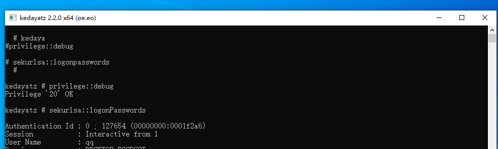
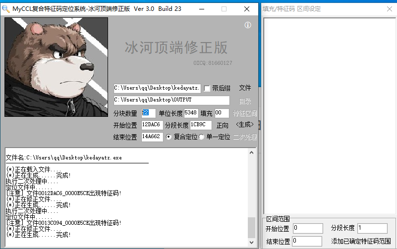
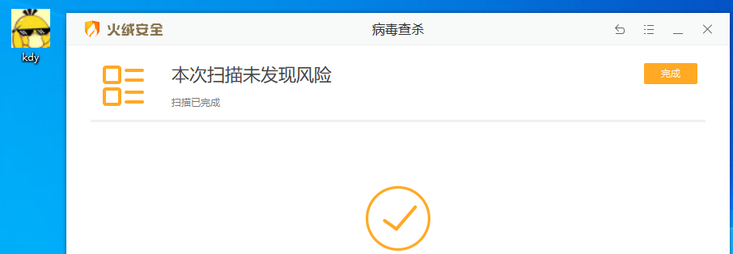

# 免杀入门

前置工具：visual studio

**前言：这里是一个学习文章，文章的内容都是学习别的师傅的，这个是复现学习文章，不是原创的。**

## mimikatz免杀


### 更改项目名


替换名字，打上大小写的勾（这里要替换两次，一次全大写一次全小写）


为了防止报错，还要更换项目的名字的kedayatz


再次生成，可以正常运行。

### 替换关键字

#### lib


该目录的


还要改一下这里面的


#### love的


#### spool


这个同样要去属性修改一下


这里的readme.me没用，可以删掉的

mimidrv显示已卸载，可以移除掉。

最后目录


### 删除资源文件

直接删除4个里面的`.rc`文件


然后重新生成，这里也可以把图标一起删了，到这里还是不能绕过特征识别，下面要进行其他修改，这里生成的没问题，可以正常执行。


### 删除源码关键字

#### 注释

先删除掉注释，因为有的杀软将**作者的邮箱**跟**blog地址**作为特征，所有文件的注释删掉


#### 输出信息

kadayatz这里改一下


hahalove的也改一下


#### 生成

生成直接使用，可以看到正常使用没问题



火绒查杀


### 定位特征码

用特征码定位工具


把分块数量设置为20-30（我也不懂，大佬是这样写的）


然后生成，就会在桌面创建一个OUTPUT文件夹


右键文件夹进行火绒安全杀毒，扫出来风险项目点立即处理，然后回到特征码定位工具点击二次处理，点击YES


点击OK，再次对OUTPUT文件夹进行火绒杀毒


然后循环这个操作，直到火绒杀毒没有风险。


回到特征码定位系统，点击特征区间，这里会出现特征码区间


右键点击，再点击复合定位此处特征


修改分块数量为20-30之间




修改之后点击生成—>查杀OUTPUT—>二次处理—>查杀OUTPUT—>二次处理—>查杀OUTPUT 直到火绒没有发现风险项时


我们再来到特征区间，右键**第一个特征**—>**复合定位此处特征** 再重复修改分块数量—>生成—>查杀OUTPUT—>二次处理—>查杀OUTPUT—>二次处理—>查杀OUTPUT—>直至无风险项


**直到**特征区间最后为xxxxxxxx_000000**01**到xxxxxxxx_000000**04**之间就不需要**复合定位此处特征**了 因为就算再处理下去也是死循环


然后记下这个特征码的位置

```
0012E928_00000003
0013DE9E_00000003
```

### 找到特征码

C32Asm找特征码


将我们的exe程序拖进来，使用**快捷键**来进行跳转（Ctrl+G） 首先跳转到我们第一个特征，把地址粘贴上去，点击确定


然后就跳转过来了，加深的那个**65**就是火绒查杀的特征


可以看到是lsass.exe，我们在文件中**找到**（这里是查找）这个字符串，**不要区分大小写**，查找范围一定是**整个解决方案**。


可以看到这里有7处


双击跳转就可以进入详细


回到C32Asm，看刚才加深的上下文，有个fope，fwprintf这些，我们在vs找到这个


可以看到这个文件有


### 修改特征码

#### 第一个特征

```
0012E928_00000003
```

lsass.exe是字符串，这里用字符串切割来隐藏特征，使用源码免杀辅助工具，点击字符串隐藏，输入隐藏的字符串，然后随机字母生成。


辅助生成的代码，将`L"lsass.exe"`这里直接上传，换成数组名，然后还要改char类型为wchar_t类型的数字。

```
char nosvxbfj[]={'l','s','a','s','s','.','e','x','e','\0'};
```

```
wchar_t nosvxbfj[]={'l','s','a','s','s','.','e','x','e','\0'};
```

替换前


替换后


这样第一个特征就处理好了，然后刚才全局找到的`lsass.exe`我们也全换掉，这里yar文件就不动他了，然后.c文件象征性改一下。


#### 第二个特征

```
0013DE9E_00000003
```


看具体


### 再次循环操作

修改好上面的特征码然后生成，再去查杀，重复上面的操作，直到火绒查不出来就成功了


### 添加资源

#### ICO

提前做好个32*32的ico文件


导入


编译后就是这个图标了。

#### 数字签名

```
python3 sigthief.py -i 带签名程序 -t 需要添加签名程序 -o 输出程序名
```


#### 编译生成


### 过查杀

#### 火绒



此时火绒已经不会拦截了 火绒过了静态等于过了动态，所以运行起来火绒也没有任何反应。

使用，正常使用没问题


#### 360

这里是要断网测试的，这里的马过不了云查杀


正常使用没问题

