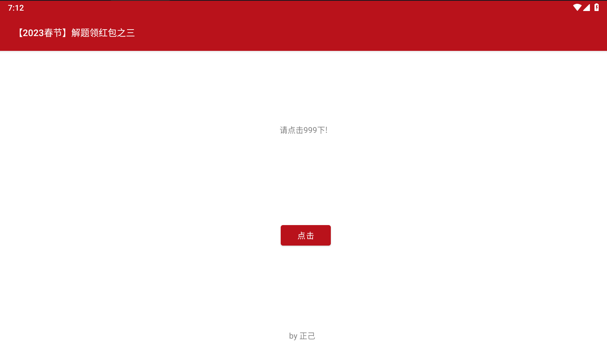

# 吾爱破解新春逆向

## 【2023春节】解题领红包之三



### 解法1-物理

点999下，但是不可能真的点

### 解法2-MT

mt管理器


改为1


修改为一个小数后安装


退出记得点自动签名，安装点3下就出来了


### 解法3-HOOK

frida的hook


```
frida -H 127.0.0.1:27042 -f com.zj.wuaipojie2023_3 -l w3.js --no-paus
```

hook中也有几个方法，修改ret为999

```
Java.perform(function(){
	var ee = Java.use("com.zj.wuaipojie2023_3.MainActivity");
	ee.check.implementation = function(){
		var ret = this.check();
		console.log("---")
		return 999;
	};
})
```

直接调用解密

```
Java.perform(function(){
	Java.choose("com.zj.wuaipojie2023_3.MainActivity",{
		onComplete:function(){},
		onMatch:function(instance){
console.log(instance.decrypt("hnci}|jwfclkczkppkcpmwckng\u007f", 2));
		}
	})
})
```


### 解法4-JEB

jeb查看


### 解法5-逆向

逆向app

```java
...
key.setText(this$0.decrypt("hnci}|jwfclkczkppkcpmwckng\u007f", 2));
...
    public final String decrypt(String encryptTxt, int i) {
        Intrinsics.checkNotNullParameter(encryptTxt, "encryptTxt");
        char[] charArray = encryptTxt.toCharArray();
        Intrinsics.checkNotNullExpressionValue(charArray, "this as java.lang.String).toCharArray()");
        StringBuilder sb = new StringBuilder();
        for (char c : charArray) {
            sb.append((char) (c - i));
        }
        String sb2 = sb.toString();
        Intrinsics.checkNotNullExpressionValue(sb2, "with(StringBuilder()) {\n…     toString()\n        }");
        return sb2;
    }

```


```
str1="hnci}|jwfclkczkppkcpmwckng\u007f"
for j in range(len(str1)):
	print(chr(ord(str1[j])-2),end="")

```


## 【2023春节】解题领红包之四

### 解法1-JEB

A中最后判断是否一致


里面有个C，跟进


我们打印s1就好


打上断点，然后步入就可以看到


```
string@11119:"35j5g53445k8j11igkj72j9h935j5f1k"
```

结合前面，这里要套flag头尾

```
flag{35j5g53445k8j11igkj72j9h935j5f1k}
```


### 解法2-HOOK

思路，把A的返回值换成true，结果只输出了个flag正确，没有flag

```
console.log('begin-----------')
Java.perform(function(){
	var cla = Java.use("com.zj.wuaipojie2023_1.A");
	cla.B.implementation = function(str,str2){
		var ret = this.B('a','b');
		console.log('continue-----------');
		return true;
	};
});

```

HOOK里面的C

```java
Java.perform(function(){
	var cla = Java.use("com.zj.wuaipojie2023_1.C");
	cla.cipher.overload('java.lang.String','int').implementation = function(str,i){
		var ret = this.cipher(str,i);
		console.log('ret===',ret);
		return ret;
	};
})

```


这里要注意一下，flag中要加上flag{}，这样才能hook到，因为A里面有个判断语句

```
if (!(str.length() == 0 && str2.length() == 0) && StringsKt.startsWith$default(str2, "flag{", false, 2, (Object) null) && StringsKt.endsWith$default(str2, "}", false, 2, (Object) null)) {
```

## 【2023春节】解题领红包之六

这个题目和apk关系不大，思路就是改为zip，拿到ase的文件和so文件，丢到ida分析，拿到key，然后解密得到png，图片分离拿到二维码。


so丢ida分析。


进去，可以看到有个realkey


在看解密过程


这里的aw是不对的，tab切过去可以看到真实的


```
|wfkuqokj4548366
```

不太理解

```
#include <stdio.h>

int main() {
    char key[] = "|wfkuqokj4548366";
    char add_mask[] = { 0xFB, 0xFE };
    for (int i = 0; i < sizeof(key) - 1; i ++)
        key[i] += add_mask[i & 1];
    printf("key = '%s'\n", key);
}
```

找到秘钥

```
wuaipojie2023114
```


然后丢010分离文件


```
https://rd.wechat.com/qrcode/confirm?block_type=101&content=flag%7BHappy%5FNew%5FYear%5FWuaipojie2023%7D
```

```
flag{Happy_New_Year_Wuaipojie2023}
```