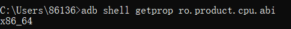
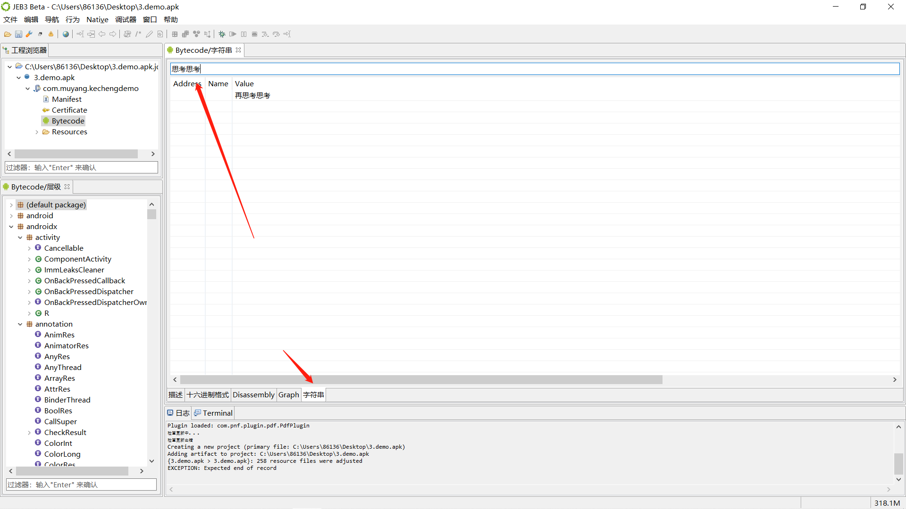
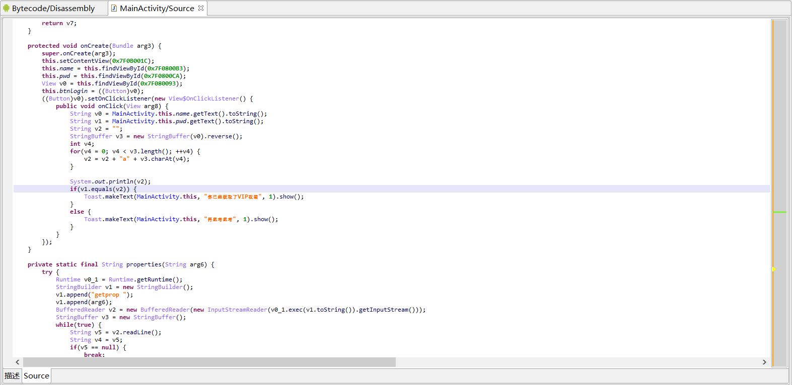

# 安卓逆向

## 安装开发

判断语句

```
if-nez
if-eqz
```

## xp框架

如果普通的xp，夜神安卓5+软件，安装后直接抓包。

## frida

### 环境搭建

adb连接

```
adb connect 127.0.0.1:62001
```


```
adb devices
```


```
adb -s 设备名 shell 	指定设备进入shell
adb -s 127.0.0.1:62001 shell
```


### frida

frida版本、Android系统版本与Python版本要一致，一定不能错（这里我换成雷电模拟器了，python是3.8.5）

```
frida12.3.6 Android5-6 Python3.7
frida12.8.0 Android7-8 Python3.8
frida14+    Android9+  Python3.8
frida15+    Android12  也可以用
```


```
pip3 install frida==14.2.18 -i https://pypi.mirrors.ustc.edu.cn/simple/
```

雷电现在是安卓9，安装frida-tools

```
pip3 install frida-tools==9.2.5 -i https://pypi.mirrors.ustc.edu.cn/simple/
```

### frida-server

frida-server、frida-gadget 、frida-inject

**frida-server的版本与frida的版本要匹配**

先判断平台版本

```
adb shell getprop ro.product.cpu.abi
```



真机用arm，模拟器，下载[frida-server-14.2.18-android-x86](https://github.com/frida/frida/releases/tag/14.2.18)


运行

```
adb push frida-server-14.2.18-android-x86_64 /data/local/tmp/fs64
adb shell
su
cd /data/local/tmp
chmod 777 fs64
./fs64
```

转发端口，进行监听（通过usb连接真机不需要转发端口，通过ip连接需要转发，连接模拟器也需要转发）

```
adb forward tcp:27042 tcp:27042
#adb forward tcp:27043 tcp:27043
```

执行frida-ps -U查看是否成功

### 案例分析

1.js

```
function main(){
	Java.perform(function(){
		// 类名
		var class_ = Java.use("com.muyang.kechengdemo.MainActivity");
		// hasRootPrivilege方法名
		class_.hasRootPrivilege.implementation = function(){
			var ret = this.hasRootPrivilege();
			console.log("ret ----  ",ret);
			return false;
		}
	});
}

setImmediate(main);
```

然后启动

```
frida -U -f com.muyang.kechengdemo -l 1.js --no-pause
frida -U -f 包名 -l 文件名  --no-pause
```

同理，如果还是报错

```
frida -H 127.0.0.1:27042 -f com.muyang.kechengdemo -l 1.js --no-pause
frida -H 127.0.0.1:27042 -f 包名 -l 文件名  --no-pause
```


这样就可以绕过root检测了


## jeb

### apk逆向

jeb打开apk，然后关键字定位



双击进来


按tab，到源代码



```java
public void onClick(View arg8) {
                String v0 = MainActivity.this.name.getText().toString();
                String v1 = MainActivity.this.pwd.getText().toString();
                String v2 = "";
                StringBuffer v3 = new StringBuffer(v0).reverse();
                int v4;
                for(v4 = 0; v4 < v3.length(); ++v4) {
                    v2 = v2 + "a" + v3.charAt(v4);
                }

                System.out.println(v2);
                if(v1.equals(v2)) {
                    Toast.makeText(MainActivity.this, "你已经获取了VIP权限", 1).show();
                }
                else {
                    Toast.makeText(MainActivity.this, "再思考思考", 1).show();
                }
```

输入

```
v0=123456
v1=v2
v3=654321
v2=""+a+6
  ="a6"+a+5
  ...
v2=a6a5a4a3a2a1
```


### 普通调试

在上面有个printf可以输出v2，我们去调试他。连接好adb。


按tab进去，ctrl+B打断点


点击调试


然后模拟器点击登录，这边就到断点


可以看到v2的值就是加密的值，如果显示int就换成string

### debug调试

首先打开雷电模拟器，保证需要调试的apk已经安装。

发现进程

```
adb shell dumpsys window | findstr mCurrentFocus
```


```
adb shell am start -D -n 应用程序包名/应用程序入口界面
adb shell am start -D -n com.muyang.kechengdemo/com.muyang.kechengdemo.MainActivity
adb shell am start -D -n com.muyang.kechengdemo/.MainActivity
```

这样也可以找到进程


## 重打包

### MT管理器

[下载 | MT管理器 (mt2.cn)](https://mt2.cn/download/)

绕过root和模拟器题目练习，源码分析。


正常情况，在模拟器打开


使用mt管理器进行绕过。

首先先把app卸载，然后丢到模拟器和电脑的共享文件夹中。


先不要安装，mt模拟器打开，查看


点击


点击Dex编辑器++


找到mainactivity


进去后找到检验root和模拟器的判断语句，修改前的判断if


修改if-nez和if-eqz，然后保存


保存退出编译


自动签名打钩，然后确定


回到外面点击安装就好，这样就可以绕过root和模拟器检测了


### AndroidKiller

大致差不多，就是找到点如何修改再编译

## 报错

### jeb1

jeb闪退


```
set base="D:\java\jdk1.8.0_152\bin"
set JAVA="D:\java\jdk1.8.0_152\bin\java.exe"
```

### jeb2

jeb显示出模拟器显示不出来进程

换个版本试一下就好

### frida1

frida-ps -U连接后报错Waiting for USB device to appear...

```
frida-ps -H 127.0.0.1:27042
```

