# 某教育小程序漏洞挖掘

文章首发i春秋：https://bbs.ichunqiu.com/thread-63559-1-1.html

## 前言

闲着没事干又来挖挖教育src的小程序，这一次还有点小绕。

## 黑盒测试

微信搜一搜随便找了一个学校。

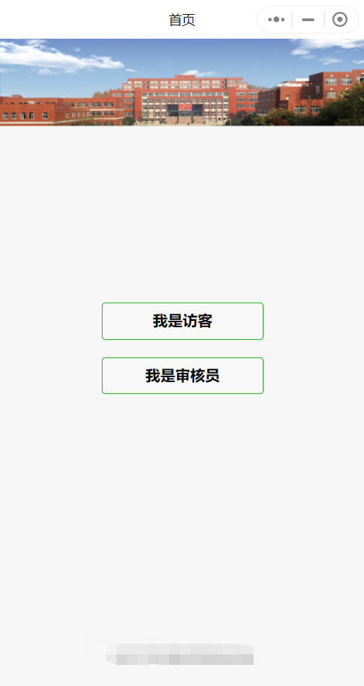

这里有两个地方可以点，审核员要账号密码，这里以访客身份直接点进去看看。

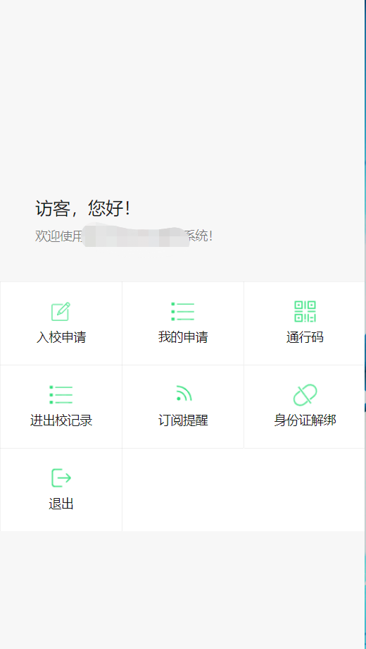

看到这些功能，就依次点击看看。

入校申请，这里填一下信息，然后burp也代理看看包的情况。

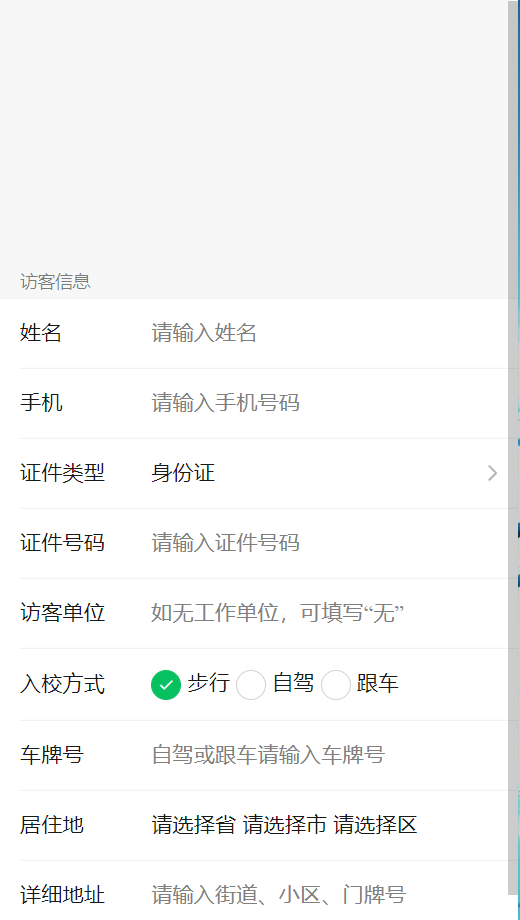

填完然后看响应包，啥也没有（以往挖这种漏洞可能会泄露个id啥的，然后我们可以遍历id）

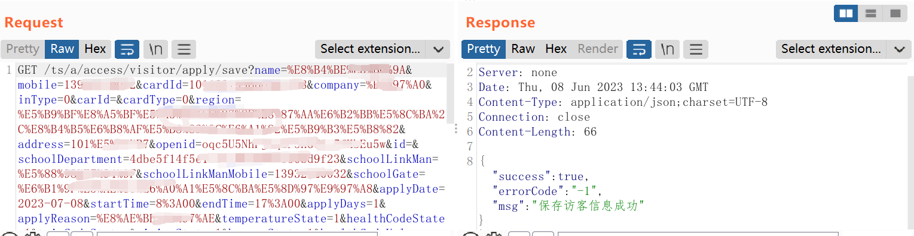

点击我的申请，看看能不能获取id啥的，这里有两个接口信息，一个是id，一个是`openid`。

但是这个id是加密过的，我们无法直接遍历出来，那就难搞了。

```
/visitor/apply/get?id=59255835xxxxxxxxxx3800d9f2ebdf
visitor/apply/listByOpenid?openid=oqc5xxxxxxxxxxxxKbEu5w
```

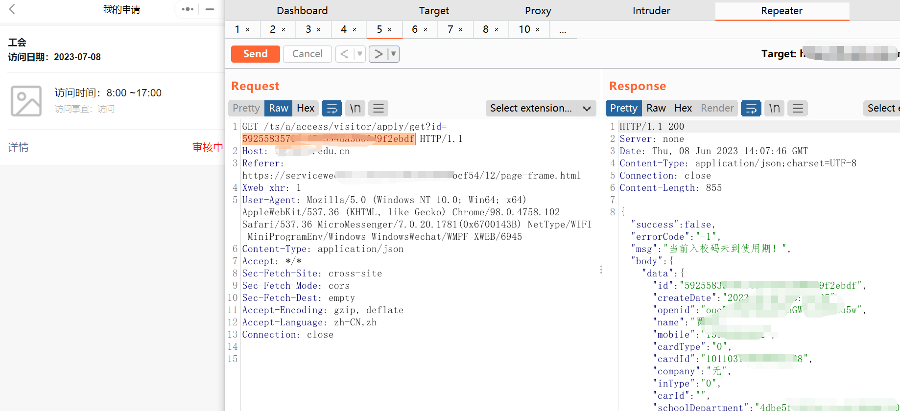

其他功能也点一点，通行码，进出校记录是工具`openid`来获取的，其他几个功能没啥用，测试到这里就没啥可以弄了，那接下来只能反汇编源码了。

## 源码分析

反汇编源码上一篇也讲过`UnpackMiniApp`解密包，然后wxpack反汇编一下就好。

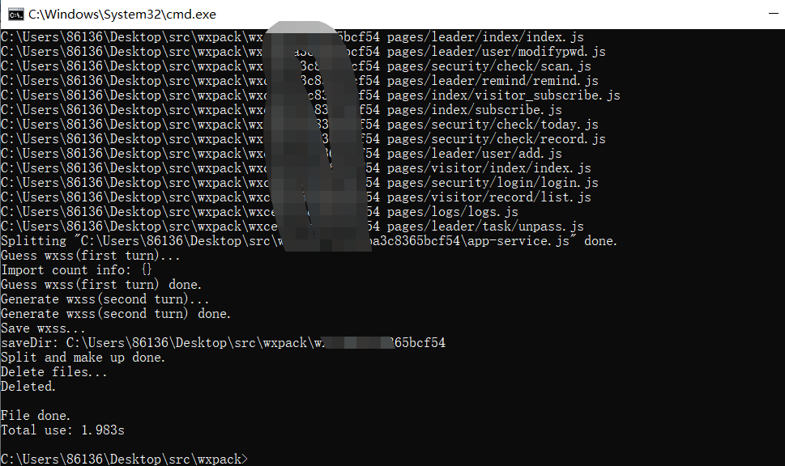

微信开发者工具打开，第一步全局搜索secret参数，看看有没有泄露的，可惜这里是没有。

然后开始源码分析，目录结构如下，我们主要看`util`和`page`这两个就好。`util`里面可能会有一些敏感信息，或者一些加密解密东西。`page`是接口的东西。

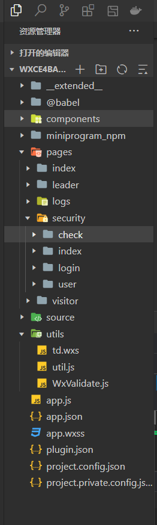

查看源码，以这个为例子，可以通过`url+/access/visitor/apply/get`然后post传个id给他进行访问，但是id我们不知道，那么我们只能找那些不用传参的接口。

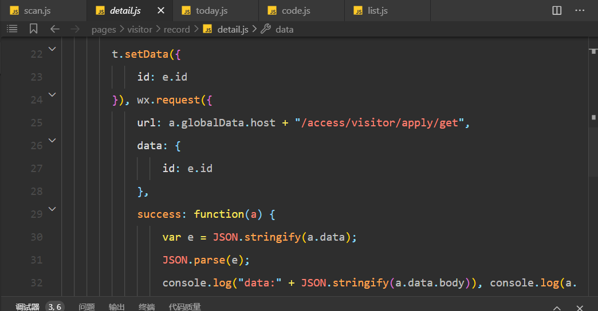

## 信息泄露

刚好在today这里找到一个。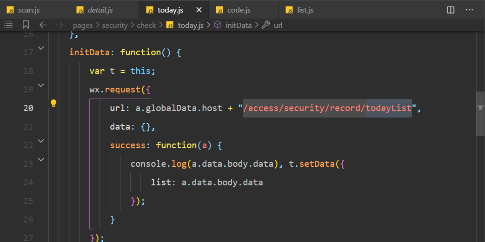

我们访问看看

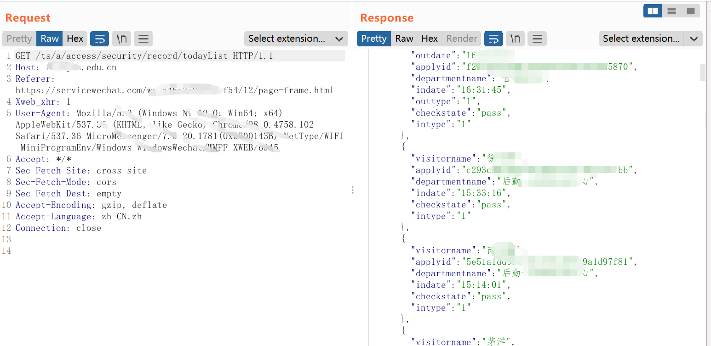

我们可以获取今天访问的id，然后回到开始，我们还有一个获取细节的接口。

```
/ts/a/access/visitor/apply/get?id=
```

我们把他拼接上去，可以看到身份证等信息。

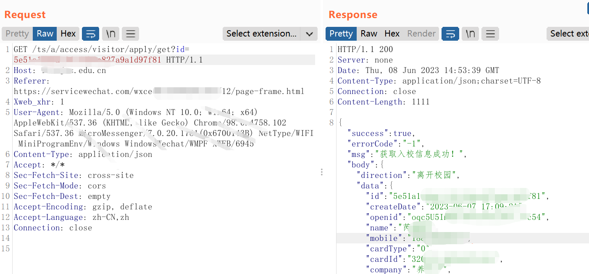

这里可以获取当日的访客的信息。