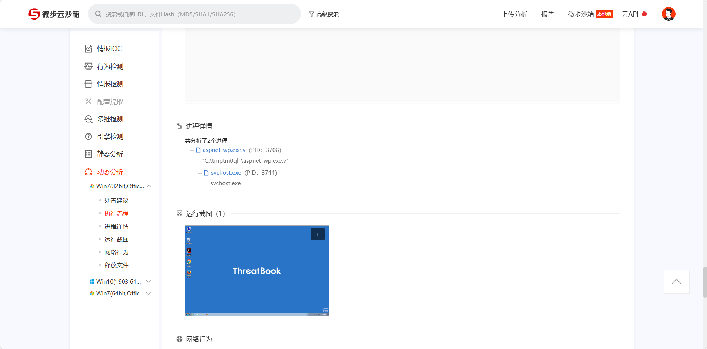
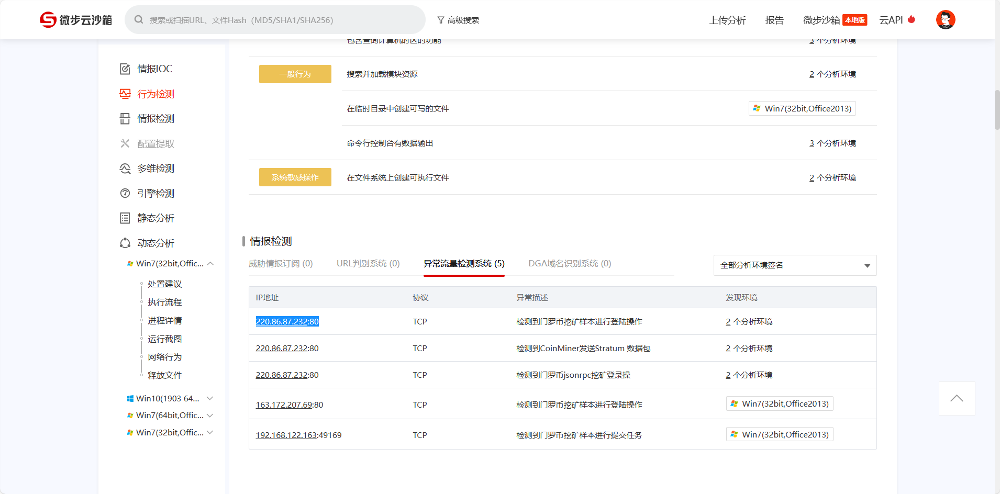
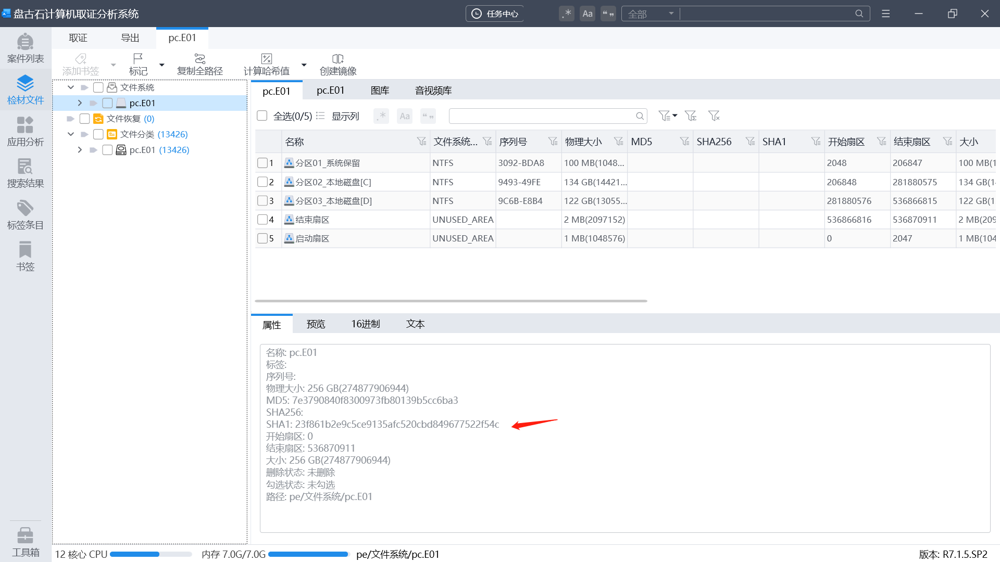
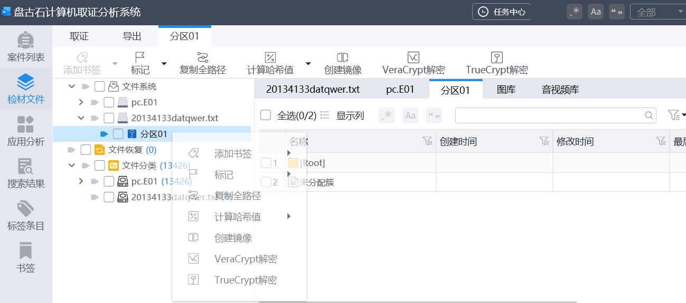

## 蓝帽杯第六届半决赛

#### 案例介绍

```
7(G?fu9A8sdgfMsfsdrfE4q6#cf7af0fc1c
```

一些对应关系，这个检材感觉有点乱，这里写一下记录一下

```
受害人\手机\苹果---手机+exe
受害人\手机\安卓---apk
```


#### 手机

1.iPhone手机的iBoot固件版本号:[iBoot-1.1.1][手机取证][★☆☆☆☆]


```
iBoot-7429.62.1
```

2.该手机制作完备份UTC+8的时间(非提取时间):[答案格式:2000-01-01 00:00:00][手机取证][★★★★☆]

查看 infoplist 文件


AXIOM Process看


找到的时间和其他的有点不一样，然后看题目有个UTC+8，我们加8就可以

```
2022-01-11 18:47:38
```

#### exe

1.文件services.exe创建可执行文件的路径是:[答案格式:C:\Windows\a.exe][exe分析][★☆☆☆☆]

这个很难找到，在受害人的苹果手机中有聊天记录，将4个附件都导出来。


这里发财工具是一个加密的zip


解压密码virus


里面就有services.exe，丢微步


```
C:\Program Files\Common Files\Services\WmiApSvr.exe
```

2.文件HackTool.FlyStudio.acz_unpack.exe是否调用了advapi32.dll动态函式链接库:[答案格式:是/否][exe分析][★★☆☆☆]

微步


```
是
```

3.文件aspnet_wp.exe执行后的启动的进程是什么:[答案格式:qax.exe][exe分析][★★★☆☆]



```
svchost.exe
```

4.文件[4085034a23cccebefd374e4a77aea4f1]是什么类型的木马:[答案格式:勒索][exe分析][★★☆☆☆]


```
挖矿
```

5.文件[4085034a23cccebefd374e4a77aea4f1]网络连接的IP地址的归属地是哪个国家:[答案格式:美国][exe分析][★★★★☆]



```
220.86.87.232
```


```
韩国
```

#### apk

1.受害人手机中exec的和序列号是:[答案格式:0xadc][APK分析][★☆☆☆☆]


直接在应用搜索exec，在安卓手机上找到了，导出来，直接导不出来直接右下角跳转到源文件进行导出。


```
0x936eacbe07f201df
```

*2.受害人手机中exec关联服务器地址是:[答案格式:asd.as.d][网络流][★★☆☆☆]


```
aHR0cHM6Ly9hbnNqay5lY3hlaW8ueHl6
```

base解密一下

```
https://ansjk.ecxeio.xyz
```

*3.受害人手机中exec加载服务器的函数是:[答案格式:asda][APK分析][★★★☆☆]


```
loadUrl
```

4.受害人手机中exec的打包ID是:[答案格式: adb.adb.cn][APK分析][★★★☆☆]


```
__W2A__nansjy.com.cn
```

5.受害人手机中exec的是否有安全检测行为:[答案格式:是/否][APK分析][★★★☆☆]


```
是
```

*6.受害人手机中exec的检测方法的完整路径和方法名是:[答案格式:a.a.a()][APK分析][★★★☆☆]


```
d.a.a.c.a.a()
```

7.受害人手机中exec有几个界面:[答案格式:2][][★★★☆☆]


三个Activity就是三个页面

```
3
```

8.受害人手机中红星IPA的包名是:[答案格式:a.s.d][IPA分析][★★☆☆☆]

受害人的安卓机找到


改为zip，Info.plist文件下找到包名


```
com.dd666.hongxin
```

9.受害人手机中红星IPA的APIKEY是:[答案格式:asd][IPA分析][★★☆☆☆]

同上

```
d395159c291c627c9d4ff9139bf8f0a700b98732
```

10.受害人手机中红星IPA的权限有:[答案格式:as d a][IPA分析][★★☆☆☆]

Info.plist文件找

```
<string>红星想使用您的相册</string>
<string>红星想使用您的地理位置信息</string>
<string>红星想使用您的摄像头</string>
<string>红星想使用您的麦克风</string>
```

```
相册 定位 摄像头 麦克风
```

11.嫌疑人手机中红星APK的服务器地址是:[答案格式:ass.a.d:11][网络流][★☆☆☆☆]


```
www.nansjy.com.cn:8161
```

12.嫌疑人手机中红星APK的程序入口是:[答案格式:a.v.b.n][APK分析][★☆☆☆☆]


```
com.example.weisitas526sad.activity.SplashActivity
```

13.嫌疑人手机中分析聊天工具，服务器的登录端口是:[答案格式:12][APK分析][★★☆☆☆]

丢模拟器找到网络设置可以看到


```
6661
```

14.嫌疑人手机中分析聊天工具，用户归属的机构是:[答案格式:太阳][APK分析][★☆☆☆☆]

```
红星
```

15.结合手机流量分析聊天工具的登录账号和密码是:[答案格式:1212311/12312asd][APK分析][网络流][★★★★☆]

打开嫌疑人的手机流量包找到login


```
{"password":"7f07965ec20841305f9e53a7a89584f4","countryCode":"86","sign":"27193c69fbbab5c8445a59568d74241d","userName":"17317289056","nonceStr":"rNDIUIe9v51hVe6OuxP8OUpklkt1zC1F","timestamp":"1641880699013"}
```

password解密


```
17317289056/b12345678b
```

#### 服务器

*1.服务器在启动时设置了运行时间同步脚本，请写出脚本内第二行内容，不算脚本注释部分。[答案格式:/abcd/tmp www.windows.com][服务器取证][★★★★☆]

执行命令 vi etc/rc.local  找到该脚本


查看该脚本，发现有一关键词“$gztmpdir”出现多次


确认该脚本是经过压缩的，执行命令 gzexe -d time.sh对脚本进行解密

```
/usr/sbin/ntpdate time.nist.gov
```

2.服务器在计划任务添加了备份数据库脚本，请写出该脚本的第二行内容。[答案格式：2022年第六届蓝帽杯][服务器取证][★★★★☆]

执行命令 crontab -l查看计划任务

```
[root@yisu-60a2196bb5a4f ~]# crontab -l
00 03 * * * /root/backup.sh.x
```

发现脚本后缀为sh.x，这个一般为shc加密，使用unshc.sh脚本进行解密

https://github.com/yanncam/UnSHc


```
#台北下着雪你说那是保丽龙
```

3.使用宝塔linux面板的密码加密方式对字符串lanmaobei进行加密，写出加密结果。[答案格式：e10adc3949ba59abbe56e057f20f883e][服务器取证][★★★☆☆]

宝塔面板的密码加密方式存放在文件“/www/server/panel/class/users.py”下


```
25b9447a147ad15aafaef5d6d3bc4138
```

4.写出服务器中第一次登录宝塔面板的时间。[答案格式：2022-02-02 02:02:02][服务器取证][★★☆☆☆]

先取消固定ip，在/etc/sysconfig/network-scripts中把外网ip删掉，然后在虚拟机加一个网络。


宝塔的入口就可以进去了


5.写出宝塔面板的软件商店中已安装软件的个数[答案格式：2][服务器取证][★★☆☆☆]


6.写出涉案网站（维斯塔斯）的运行目录路径。[答案格式：/root/etc/sssh/html][服务器取证][★★☆☆☆]


7.写出最早访问涉案网站后台的IP地址。[答案格式：111.111.111.111][服务器取证][★★☆☆☆]


8.写出涉案网站（维斯塔斯）的“系统版本”号。[答案格式：6.6.6666][服务器取证][★★★☆☆]


```
1.0.190311
```

9.分析涉案网站的会员层级深度，写出最底层会员是多少层。[答案格式：66][服务器取证][★★★★☆]


10.请写出存放网站会员等级变化制度的网站代码文件的SHA256值。[答案格式: 8d969eef6ecad3c29a3a629280e686cf0c3f5d5a86aff3ca12020c923adc6c92][服务器取证][★★★☆☆]


11.计算向网站中累计充值最多的五名会员，获得的下线收益总和(不包含平台赠送)。[答案格式：666.66] [服务器取证][★★★★☆]


12.统计涉案网站中余额大于0且银行卡开户行归属于四川省的潜在受害人数量。[答案格式：6][服务器取证][★★★☆☆]


13.统计涉案网站中余额大于0且银行卡开户行归属于四川省的潜在受害人数量。[答案格式：6][服务器取证][★★★☆☆]


14.统计涉案网站哪一天登录的会员人数最多。[答案格式：1999-09-09][服务器取证][★★★★★]


15.写出涉案网站中给客服发送“你好，怎么充值”的用户的fusername值。[答案格式：lanmaobei666][服务器取证][★★★★★]


[第六届“蓝帽杯”半决赛取证题目官方解析 (qq.com)](https://mp.weixin.qq.com/s/b133hsC1ZR02ML6efy2tOg)

## 第七届初赛

#### 案例介绍

```
2021年5月，公安机关侦破了一起投资理财诈骗类案件，受害人陈昊民向公安机关报案称其在微信上认识一名昵称为yang88的网友，在其诱导下通过一款名为维斯塔斯的APP，进行投资理财，被诈骗6万余万元。接警后，经过公安机关的分析，锁定了涉案APP后台服务器。后经过公安机关侦查和研判发现杨某有重大犯罪嫌疑，经过多次摸排后，公安机关在杨某住所将其抓获，并扣押了杨某手机1部、电脑1台，据杨某交代，其网站服务器为租用的云服务器。上述检材已分别制作了镜像和调证，假设本案电子数据由你负责勘验，请结合案情，完成取证题目。
```

```
取证检材容器密码：Hpp^V@FQ6bdWYKMjX=gUPG#hHxw!j@M9
```

#### 软件

雷电APP智能分析，火眼取证，火眼仿真，盘古石计算机取证

#### APK

【APK取证】涉案apk的包名是？[答题格式:com.baid.ccs]

雷电app看


```
com.vestas.app
```

【APK取证】涉案apk的签名序列号是？[答题格式:0x93829bd]


```
0x563b45ca
```

【APK取证】涉案apk中DCLOUD_AD_ID的值是？[答题格式:2354642]

雷电的值和反汇编的不一样


【APK取证】涉案apk的服务器域名是？[答题格式:http://sles.vips.com]

app抓包

```
https://vip.licai.com
```

【APK取证】涉案apk的主入口是？[答题格式:com.bai.cc.initactivity]


```
io.dcloud.PandoraEntry
```

#### 手机

【手机取证】该镜像是用的什么模拟器？[答题格式:天天模拟器]


```
雷电模拟器
```

【手机取证】该镜像中用的聊天软件名称是什么？[答题格式:微信]


```
与你
```

【手机取证】聊天软件的包名是？[答题格式:com.baidu.ces]


```
com.uneed.yuni
```

【手机取证】投资理财产品中，受害人最后投资的产品最低要求投资多少钱？[答题格式:1万]


```
5万
```

【手机取证】受害人是经过谁介绍认识王哥？[答题格式:董慧]


```
华哥
```

#### 计算机

【计算机取证】请给出计算机镜像pc.e01的SHA-1值？[答案格式：字母小写]



```
23f861b2e9c5ce9135afc520cbd849677522f54c
```

【计算机取证】给出pc.e01在提取时候的检查员？[答案格式：admin]

xways可以看到，别人wp的


```
pgs
```

【计算机取证】请给出嫌疑人计算机内IE浏览器首页地址？[答案格式：http://www.baidu.com]

仿真然后进去系统查看，按理没问题


```
http://global.bing.com
```

【计算机取证】请给出嫌疑人杨某登录理财网站前台所用账号密码？[答案格式：root/admin]


```
yang88/3w.qax.com
```

【计算机取证】请给出嫌疑人电脑内pdf文件默认打开程序的当前版本号？[答案格式：xxxx(xx)]

仿真打开wps查看


```
2023春季更新(14309)
```

【计算机取证】请给出嫌疑人计算机内文件名为“C盘清理.bat”的SHA-1？[答案格式：字母小写]

火眼查看

在D盘下有个disk.img，添加为新检材就可以看到


找到文件


计算hash


iSCSI查看

仿真然后win+r，输入iscsicpl.exe就会弹出来，点击是


弹出来这个打开找到c盘清理复制出来计算hash


```
24CFCFDF1FA894244F904067838E7E01E28FF450
```

【计算机取证】请给出嫌疑人Vera Crypt加密容器的解密密码？[答案格式：admin!@#]

20134133datqwer.txt这个文件，将其导入盘古石里面


盘古石对memdump.mem进行内存取证


这里有Vera Cryptd的秘钥进行导出，然后将导入的20134133datqwer.txt右键使用**内存密钥**文件进行VC解密。



找到重要文件打开


```
3w.qax.com!!@@
```

【计算机取证】请给出嫌疑人电脑内iSCSI服务器对外端口号？[答案格式：8080]

pc.e01仿真中找到starwind


可以看到端口


```
3261
```

【计算机取证】请给出嫌疑人电脑内iSCSI服务器CHAP认证的账号密码？[答案格式：root/admin]


可以看到user，密码这里看不到

在火眼中导出整个文件夹


直接全局搜索，在StarWind.cfg中的chapLocalSecret找到


```
user/panguite.com
```

【计算机取证】分析嫌疑人电脑内提现记录表，用户“mi51888”提现总额为多少？[答案格式：10000]

在上面的vc中找到xlsx文件，直接统计。


```
1019
```

#### 内存

【内存取证】请给出计算机内存创建北京时间？[答案格式：2000-01-11 00:00:00]


```
2023-06-21 01:02:27
```

【内存取证】请给出计算机内用户yang88的开机密码？[答案格式：abc.123]


```
3w.qax.com
```

【内存取证】提取内存镜像中的USB设备信息，给出该USB设备的最后连接北京时间？[答案格式：2000-01-11 00:00:00]

这里要加8


```
2023-06-21 01:01:25
```

【内存取证】请给出用户yang88的LMHASH值？[答案格式：字母小写]


```
aad3b435b51404eeaad3b435b51404ee
```

【内存取证】请给出用户yang88访问过文件“提现记录.xlsx”的北京时间？[答案格式：2000-01-11 00:00:00]

```
volatility -f memdump.mem --profile=Win7SP1x64 timeliner > ./1.txt
```

搜索URL编码的提现记录.xlsx：

%E6%8F%90%E7%8E%B0%E8%AE%B0%E5%BD%95.xlsx


```
2023-06-21 00:29:16
```

【内存取证】请给出“VeraCrypt”最后一次执行的北京时间？[答案格式：2000-01-11 00:00:00]

火眼分析计算机检材中查看用户痕迹


```
2023-06-21 00:47:41
```

【内存取证】分析内存镜像，请给出用户在“2023-06-20 16:56:57 UTC+0”访问过“维斯塔斯”后台多少次？[答案格式:10]

火眼查看计算机检材的Chrome浏览器历史记录


```
2
```

【内存取证】请给出用户最后一次访问chrome浏览器的进程PID？[答案格式：1234]

```
volatility -f memdump.mem --profile=Win7SP1x64 pslist
```


```
2456
```

#### 服务器

【服务器取证】分析涉案服务器，请给出涉案服务器的内核版本？[答案格式：xx.xxx-xxx.xx.xx]

仿真.qcow2服务器


```
3.10.0-957.el7.x86_64
```

【服务器取证】分析涉案服务器，请给出MySQL数据库的root账号密码？[答案格式：Admin123]

这里有宝塔，进去后改一下密码


进去后台，这里数据库有个密码，但是是错误的


在网站根目录下的.env文件中也有一个数据库root密码


```
ff1d923939ca2dcf
```

【服务器取证】分析涉案服务器，请给出涉案网站RDS数据库地址？[答题格式: xx-xx.xx.xx.xx.xx]


```
pc-uf6mmj68r91f78hkj.rwlb.rds.aliyuncs.com
```

【服务器取证】请给出涉网网站数据库版本号? [答题格式: 5.6.00]


```
5.7.40
```

【服务器取证】请给出嫌疑人累计推广人数？[答案格式：100]

检材中还有个数据库文件，打开查看。

[阿里云Mysql5.7 数据库恢复 qp.xb文件恢复数据](https://blog.csdn.net/weixin_40230682/article/details/118703478)

安装qpress

```
wget "http://docs-aliyun.cn-hangzhou.oss.aliyun-inc.com/assets/attach/183466/cn_zh/1608011575185/qpress-11-linux-x64.tar"
tar xvf qpress-11-linux-x64.tar
chmod 775 qpress
cp qpress /usr/bin
```

安装xtrabackup 

```
wget https://www.percona.com/downloads/XtraBackup/Percona-XtraBackup-2.4.9/binary/redhat/7/x86_64/percona-xtrabackup-24-2.4.9-1.el7.x86_64.rpm
```

```
yum install -y percona-xtrabackup-24-2.4.9-1.el7.x86_64.rpm
```

把.xb数据库传到服务器上


使用xbstream处理qp.xb文件

```
cat /tmp/hins261244292_data_20230807143325_qp.xb | xbstream -x -v -C /www/server/data
```


进入/www/server/data进行解压

```
cd /www/server/data
innobackupex --decompress --remove-original /www/server/data
innobackupex --defaults-file=/etc/my.cnf --apply-log /www/server/data
chown -R mysql:mysql /www/server/data
```

修改mysql配置文件

```
vim /etc/my.cnf
#在[mysqld]块下添加
lower_case_table_names=1
```

修改mysql配置文件(还是/etc/my.cnf)，添加skip-grant-tables跳过登录验证


重启mysql服务

```
service mysql restart
mysql -uroot -pbad11d923939ca2dcf
```

这样就可以看到数据库了


查看配置文件，可以看到端口是8083


进去后还是报错，修改网站目录下的.env文件


进入网站


找到后台登录口，在内存取证哪里就有看到


```
/AdminV9YY/Login
```

这里数据库账号密码加密了，直接改源码绕过登录


直接把密码验证删除


后台界面


嫌疑犯是yang88


```
69
```

【服务器取证】请给出涉案网站后台启用的超级管理员?[答题格式:abc]


用root登录看看，可以看到admin是超级管理员


```
admin
```

【服务器取证】投资项目“贵州六盘水市风力发电基建工程”的日化收益为？[答题格式:1.00%]


```
4.00
```

【服务器取证】最早访问涉案网站后台的IP地址为[答题格式:8.8.8.8]


```
183.160.76.194
```

【服务器取证】分析涉案网站数据库或者后台VIP2的会员有多少个[答案格式:100]


```
20
```

【服务器取证】分析涉案网站数据库的用户表中账户余额大于零且银行卡开户行归属于上海市的潜在受害人的数量为[答题格式:8]

宝塔phpadmin进去看

```
SELECT * FROM `member` WHERE bankaddress LIKE '%上海%'
```


```
2
```

【服务器取证】分析涉案网站数据库或者后台，统计嫌疑人的下线成功提现多少钱？[答题格式:10000.00]


```
128457.00
```

【服务器取证】分析涉案网站数据库或者后台受害人上线在平台内共有下线多少人？[答题格式:123]

推荐人也就是上线ID为513935，就是嫌疑人


```
SELECT COUNT(*) FROM `member` WHERE inviter = '513935'
```


```
17
```

【服务器取证】分析涉案网站数据库或者后台网站内下线大于2的代理有多少个？[答题格式:10]

```
SELECT COUNT(*) AS inviter_count, `inviter` FROM `member` GROUP BY `inviter` HAVING COUNT(*) > 2;
```


```
60
```

【服务器取证】分析涉案网站数据库或者后台网站内下线最多的代理真实名字为[答题格式:张三]

```
SELECT COUNT(*) AS inviter_count, `inviter` FROM `member` GROUP BY `inviter` ORDER BY inviter_count DESC
```


```
SELECT realname FROM `member` WHERE invicode = 617624
```


```
骆潇原
```

【服务器取证】分析涉案网站数据库或者后台流水明细，本网站总共盈利多少钱[答题格式:10,000.00]

流水明细表为moneylog

```
SELECT sum(moneylog_money)  from `moneylog` where moneylog_status = "+"
SELECT sum(moneylog_money)  from `moneylog` where moneylog_status = "-"
```

```
19882178.77
4803382.39
```


相减起来


```
15,078,796.38
```

